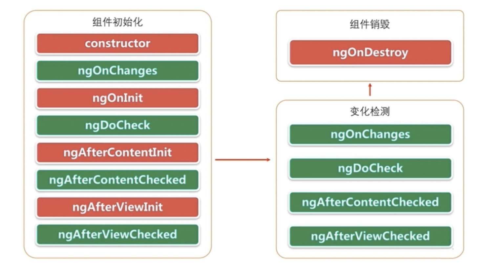

1.3 Angular Component
==============================

* `Command to generate component`_
* `Keys in Component`_
* `Life-Cycle`_

Command to generate component
---------------------------------

.. code-block:: bash
  
  ng generate component header
  ng generate component login –module login

Then 4 files would be generated: 

* header.component.html - for layout
* header.component.scss - for stype
* header.component.spec.ts - for testing
* header.component.ts - for action handling

Keys in Component
----------------------

* selector: 用于被外部引用这个组件
* templateUrl/stypeUrls: 对应的视图和Style
* imputs/outputs

.. code-block:: typescript
  
  import { Component, OnInit } from '@angular/core';

  @Component({
    selector: 'app-login',
    templateUrl: './login.component.html',
    styleUrls: ['./login.component.scss']
  })
  export class LoginComponent implements OnInit {

    constructor() { }

    ngOnInit() {
    }
  
  }

Life-Cycle
-------------------

.. index:: Angular
