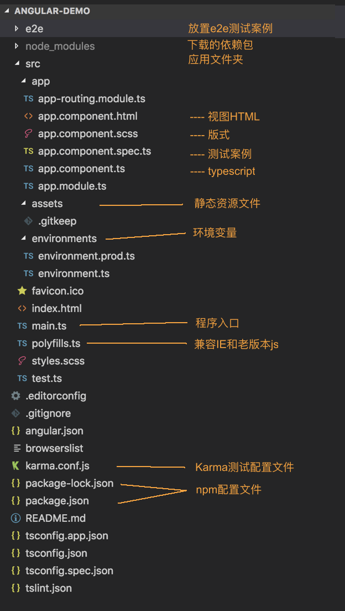

1.1. Angular-CLI Basic
==============================

*  `环境准备`_
*  `创建新项目`_ ： ng new [ApplicationName]
*  `项目启动`_ （默认端口4200）ng serve
*  `运行项目中的测试`_ ： ng test / ng e2d
* 项目构建： ng build

* 代码模块生成： ng generate [component|directive|pipe|service|class|guard|interface|enum|module] [name]

**More refer to:** https://github.com/angular/angular-cli

环境准备
-----------

* IDE Editor: Visual Studio Code
* 安装Node.js  ( node -v)
* 安装npm  (npm -v)
* 安装angular-cli  (npm install -g @angular/cli)
* Other UI related:

    - npm install --save @angular/material @angular/cdk @angular/animations
    - npm install --save hammerjs

创建新项目
-----------
.. code-block::

  ng new pokemon-wiki

项目启动
-----------

.. code-block::

  ng serve
 
* 当代码有变动时，将自动更新
* 默认启动路径http://localhost:4200
* 启动原理：

  * 在angular.json中配置了"architect"属性的"main”和“index”
  * main.ts 中配置了bootStrapModule为AppModule
  * AppModule(app.module.ts)启动Angular模块（@ngModule)
  * @ngModule为AppModule添加元数据，并且制定了[bootstrap]为AppComponent
  * 在AppComponent里有CSS选择器selector: app-root 
  * Index.html中导入<app-root> component

运行项目中的测试
-------------------

.. code-block::
  
  ng test
  
* 将会在一个新的浏览器中使用Karma运行
* Karma更多信息参考：`Karma in Github <https://karma-runner.github.io/latest/index.html>`_
* 如希望使用其他测试引擎(如jest），可在安装后配置package.json, “scripts”内的“test”命令指向新引擎

端到端测试
^^^^^^^^^^

.. image:: ../../images/e2e.png
  :width: 600px

.. index:: angular, UI

