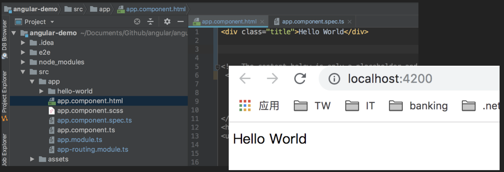

Hello World of Angular
============================

Basic steps
---------------

app.component.html
^^^^^^^^^^^^^^^^^^^^^^
.. code-block:: HTML

  
Hello World

app.component.scss
^^^^^^^^^^^^^^^^^^^^^^

.. code-block:: CSS
  
  .title {
    text-align: center
  }

Value assign via Typescript
-------------------------------

app.component.html
^^^^^^^^^^^^^^^^^^^^^^
.. code-block:: HTML

  
{{content}}

app.component.ts
^^^^^^^^^^^^^^^^^^^^^^
.. code-block:: javascript
  
  import { Component } from '@angular/core';

  @Component({
    selector: 'app-root',
    templateUrl: './app.component.html',
    styleUrls: ['./app.component.scss']
  })
  export class AppComponent {
    title = ‘angular-demo';
    content = 'Hello World';
  }

More basic Angular template
--------------------------------

**条件判断ng-if**

.. code-block:: HTML

  
{{content}} 
    
{{name}}

  

  
 **条件else**

.. code-block:: HTML

  
{{content}} {{name}}

  <ng-template #welcome>Welcome! Please logon</ng-template>

**For循环**

* ngFor="let ppl of nameList"

.. code-block:: HTML

  
{{content}} 
    
{{ppl}}

  

 
.. code-block:: TYPESCRIPT

  nameList: string[];
  this.nameList = ['Kevin', 'Amy', 'Bonson'];

