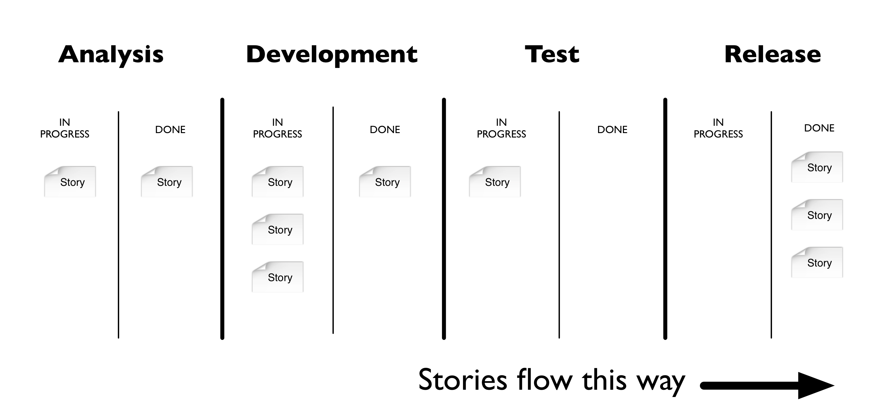

An Appropriate Use of Metrics
=============================

.. note::
  **This is article from Martin Fowler** `An Appropriate Use of Metrics <https://martinfowler.com/articles/useOfMetrics.html>`_

管理层喜欢他们的度量标准。这种想法是这样的:“我们需要一个数字来衡量我们做得如何。数字让人专注，帮助我们衡量成功。”虽然出发点是好的，但是用数字进行管理会导致不直观的问题行为，并最终影响更广泛的项目和组织目标。度量本身并不是一件坏事;只是经常使用不当。本文演示了管理传统上使用度量标准所导致的许多问题，并提供了解决这些功能障碍的替代方法。

.. toctree::
        :glob:
        :titlesonly:

        *
 

What's wrong with how we use metrics?
-------------------------------------

从数字管理的角度看指标的组织遵循这样一个过程:

* 管理人员提出一个目标并制定一个措施
* 管理层为从事这项工作的人员制定了一个长期目标(3-6个月至一年)
* 管理层只沟通目标(根据商定的度量标准)
* 做这项工作的人尽其所能达到目标数字

这个过程鼓励重载一个指标，其目的如下:

* 指标作为目标——数字指标使人们特别容易将其作为沟通目标的唯一手段。告诉人们比例和数字往往比解释一个复杂得多的目标要容易得多。目标常常是一个任意的数字，一些组织甚至花费过多的时间来确定这个数字应该是多少。
* 度量标准是对绩效的一种度量——有了一个确定的数字而不是一个清晰的目标，现在管理者很容易使用相同的度量方法来跟踪人们完成工作的速度。许多组织将这些数字与个人绩效目标联系起来。
* 指标作为最佳实践——使用指标作为目标和性能度量会产生意想不到的副作用——这意味着该指标是实现目标的最佳方法。当一个独立的政党使用一个数字目标来衡量其他人时，它会对从事这项工作的人施加更大的压力，只为了达到一个既定的数字。因为它们只根据这个度量的性能来度量，所以它们会尽其所能来实现这个特定的度量。这意味着没有其他方法是最好的实现最终目标。

具有多个目的的单一度量的重载会导致许多问题，特别是在处理软件等知识工作时。度量是更复杂属性的简化。简化复杂性的代价是以忽略真正的最终目标为代价的，并以次优结果告终。

让我们来看一个例子:

.. seealso::

  测试经理，我们叫她Mary，每周和开发主管Dan开会。“我们的错误计数到哪了?”丹回答说:“我们清除了我们的三个优先级为1的bug，修复了四个优先级为2的bug，并创纪录地清除了12个优先级为3的bug。相当不错的一周，对吧?”
  
  玛丽看着开发主管，微微摇了摇头，回答道:“不幸的是，我们的客户报告了5个优先级为1的bug、6个优先级为2的bug和15个优先级为3的bug。你下周需要更努力地工作。”达恩因为没能达成目标而感到恼怒和不知所措，他离开会议时想着让他的团队再工作一个周末。
  

在这个非常简单的故事中，所选择的度量标准满足了使会议快速进行的一个好处。当丹报告了他的结果和玛丽的反应后，两个人都很快理解了进展。不幸的是，交付有用软件的隐含目标被忽略了，Dan离开会议时提出的解决方案更有可能导致进一步的软件问题，并拖累软件质量。

玛丽陈述目标的方式给丹施加了减少虫子数量的压力。这似乎是一个令人钦佩的目标。虽然减少bug的数量是一个很好的目标，但它也会导致非常反应性的解决方案。丹离开会议时心想，工作要辛苦得多。Mary提出的问题没有忽略更广泛的目标，她也没有提出引导Dan和他的团队修复bug存在的根本原因的关键问题。如果不解决这个根本原因，Dan和他的团队注定要终生修复bug。

Dan正在经历单回路学习 [#1]_。单回路学习是对同一问题的反复尝试，没有方法的变化，也没有对目标的质疑。如果Dan希望打破这个恶性的bug循环，他需要做一些不同的事情。不恰当地使用软件使Dan偏离了交付有用软件和提高整体软件质量的最终目标。爱因斯坦对精神错乱的定义似乎很适合这里:“一遍又一遍地做同一件事，却期望得到不同的结果。”

Be careful what you measure
---------------------------

组织喜欢度量标准，因为它使设置目标更容易，并且阻止人们质疑目标背后的目标。这导致管理者对组织效率有错误的认识。与强大的度量标准相关联的强大激励机制迫使人们只专注于工作的一部分，而忽略了可能使目标更成功的其他促成因素。组织必须警惕这种导致人们忽视其他重要因素的积极的破坏性焦点。

即使是敏捷技术也不能保护团队不受测量和跟踪错误数字所驱动的不良行为的影响。例如，敏捷团队经常使用故事卡 [#2]_进行开发工作。团队经常在组织的软件生命周期中可视化这些小的增量工作。一个典型的过程可能是这样的，理想的故事流从左到右移动:

管理和产品管理经常会问这样一个问题:“这个特性要多久才能完成?”团队通常选择在编码完成时将其解释为，屈服于这样一种思想，即测试和通向生产的路径是软件过程中琐碎和无关紧要的部分。项目管理通过问“本周我们完成了多少个故事的编码?”而不是问“我们愿意向最终用户发布多少个故事?”或“我们向最终用户发布了多少个故事?”一个更好的问题是，“我们的用户从我们最近的发布中发现了多少价值?”

团队想要做正确的事情，而这些问题和度量标准因此驱使开发人员将精力集中在完成故事开发上。让我们看看只关注这个次优目标的后果:

.. seealso::

  马尔科姆是一名市场代表，他总是对开发人员为他构建的东西非常感兴趣，并尽可能频繁地去拜访团队。他经常与开发人员Dan交谈，询问他的功能何时完成。丹不想让马尔科姆失望，他努力把注意力集中在完成马尔科姆的任何要求上，知道他很快就会回来询问进度。他经常对自己说:“这个特性一定很重要。”Tim是团队中最新的测试人员，经常需要接触像Dan这样的开发人员，以了解如何触发新开发的特性。

  一天，蒂姆走近丹，“嗨，丹!我真的需要你的帮助来理解如何测试你上周完成的这个功能。”丹在传照片的压力下说:“你一个人做不了什么吗?我需要完成这个功能，这样马尔科姆就不会再烦我了。”丹的反应让蒂姆大为震惊，他回到自己的办公桌前，等待着。他自言自语道:“除非丹帮我，否则我什么也做不了。”

  每周都会发生这种情况，随着时间的推移，等待测试的故事堆会越来越多。最终，Malcolm召集了一个团队开会，他担心两个月前他要求的功能还没有投入生产。丹很惊讶，他说他一个多月前就完成了。蒂姆害羞地回答说:“我不能测试那个故事，因为我需要丹的帮助，而他一直忙于其他工作。我不想打断他。”
  
 
我们能从这个故事中学到什么?首先，对马尔科姆来说，重要的是工作流程正在完成。尽管马尔科姆问什么时候会完成，但他真正想要的是能够在生产中使用它。我们知道蒂姆没有必要完成的知识，他的工作和丹完成更多工作的压力阻止了蒂姆获得更多的知识。最终的结果是测试工作的恶性循环不断累积，始终没有发布。马尔科姆很困惑，为什么没有收到他想要的功能。这就是为什么像看板软件开发这样的方法鼓励明确的进度限制。这些限制迫使人们在出现瓶颈时帮助他人。这些WIP限制工作是为了克服当人们用错误的个人生产力而不是整体价值来衡量时出现的不受欢迎的行为。这本名为《精益软件开发》的书强调了测量最终结果的重要性，而不是简单地测量过程的一小部分，书中提出了一个他们称之为“Optmize整体”的原则。优化整体意味着确保使用的度量标准不会驱动次优化的行为，从而达到交付有用软件的真正目标。

Guidelines for a more appropriate use of metrics
------------------------------------------------

考虑到由于不恰当地使用度量而出现的不希望出现的行为，这是否意味着它们没有位置?当然，度量是有一席之地的。我们需要的是一种不同的方法。使用以下指导方针来引导您更恰当地使用度量标准:

* 明确地将指标与目标联系起来
* 喜欢跟踪趋势而不是绝对数字
* 使用较短的跟踪周期
* 当度量标准停止驱动变更时，更改它们

我们将使用下面的部分来探究这些含义。

Explicitly link metrics to goals
^^^^^^^^^^^^^^^^^^^^^^^^^^^^^^^^

在传统的风格中，管理决定了对特定目标的最佳度量。然后，管理层根据这个标准设定了一个目标。然后，管理层只向从事这项工作的人员说明这个目标，通常是用数字表示的。选择用来监视目标进展的度量和实际目标之间的界限模糊了。随着时间的推移，衡量标准背后的原因就会消失，人们会专注于实现目标，即使这个指标不再相关。度量标准更合适的用法是确保为进度选择的度量标准(度量)被梳理出来，但与它的目的(目标)相关。

例如，在软件开发上下文中，您可能会看到这样定义的指标:

.. seealso::
  方法必须小于15行。一个方法的参数不能超过4个。方法圈复杂度不能超过20。

使用适当的度量标准，每一个度量标准都应该清楚地与其原始目的相关联。当前用于跟踪和监视的机制必须与其目标解耦，并且该目标必须明确，以帮助人们更好地理解度量的意图。度量标准在其存在的更丰富的上下文中指导人们朝着目标做出更合适、更实用和最终更有用的决策。如果没有它的目的，所花费的努力意味着人们找到了创造性地玩弄他们的系统的方法，最终偏离了真正的目标。它是这样的:

.. seealso::
  我们希望我们的代码更简单，更容易修改。因此，我们应该致力于编写短方法(少于15行)和低圈复杂度(少于20行是好的)。我们还应该有少量的参数(最多4个)，以便方法尽可能集中。

明确地将度量指标与目标联系起来，可以让人们更好地挑战它们的相关性，找到满足需求的其他方法，并帮助人们理解数字背后的意图。如果没有明确的目标，人们可能会找到方法，无意中违背隐含的目标。例如，一些技术可能有助于减少方法的长度，但是如果没有正确地应用这些技术，就会增加阅读的难度，从而增加整体的复杂性。

软件开发的本质意味着大多数工作是知识工作，因此很难观察。监视活动(他们坐在电脑前的时间)很容易，但是观察他们产生的价值(满足实际需求的有用软件)却很难。人们离代码越远，就越难理解其中的复杂性。这意味着，对于远离工作的人来说，要真正了解监控实现目标进展的最佳措施是非常困难的，如果不是不可能的话。

向更适当地使用度量标准的转变意味着管理不能孤立地提出度量标准。他们必须不再欺骗自己，以为自己知道监控进展的最佳方法，并停止执行可能与目标最相关、也可能不是最相关的措施。相反，管理层负责确保最终目标始终在眼前，与对系统了解最多的人合作，提出最有意义的措施来监控进度。

Favor tracking trends over absolute numbers
^^^^^^^^^^^^^^^^^^^^^^^^^^^^^^^^^^^^^^^^^^^^

管理人员发现度量标准很难抗拒，因为它将组织的复杂性分解为每个人都能理解的东西，一个数字。很容易看到一个数字比另一个大或小，或者一个数字离另一个数字有多远。要想知道这个数字是否仍然有意义，难度要大得多。这种传统的管理方法喜欢使用这些度量，因为当目标达到时，它使沟通变得容易。“只要打这个号码，我们就会没事的。”

当您将一个定性的和高度解释性的问题(考虑生产力、质量和可用性)转换为一个数字时，任何数字都是相对的和任意的。代码覆盖率为5%和95%之间可能存在显著差异，但94%和95%之间真的存在显著差异吗?选择95%作为目标可以帮助人们理解什么时候应该停止，但是如果这需要一个数量级的努力才能达到最后1%，这真的值得吗?这只是人们必须在自己的组织背景下主观地解决的问题。

观察趋势比是否达到目标提供更有趣的信息。确定目标是否达到很容易。最难的工作，也是管理层必须与有技能的人一起完成的工作，是观察趋势，看它们是否朝着预期的方向和足够快的速度发展。趋势为从组织复杂性中产生的绩效提供了领先指标。当趋势越来越偏离预期状态时，关注数字上的差距显然毫无意义。

关注趋势是很重要的，因为它提供了基于任何实现的变更的真实数据的反馈，并为组织提供了更多的选项来做出反应。例如，如果团队偏离了期望的状态，他们可以问自己是什么原因导致他们偏离目标，以及他们能做些什么。它比在计算出一个数字之前尽可能多地做事情更早地抢占了行动的先机。如果一个团队发现自己趋向于一个期望的状态，他们可以问自己是什么在帮助他们朝着目标前进，还有什么可以做来加速这个速度。度量团队鼓励人们进行更多的实验。调整一件事，观察它对趋势的影响，监控你所处的理想状态，并知道何时停止。

任意的绝对数字也会产生无助感，尤其是当目标进展缓慢，并且依赖于集团控制之外的其他部门或公司政策，阻碍了更多的进展时。趋势帮助人们集中精力朝着正确的方向前进，而不是在看起来不可能解决的鸿沟之间停滞不前。

更恰当地使用度量需要管理层更多地参与趋势的报告和记录，因为围绕团队的生态系统是管理层的责任。这个生态系统包括组织的策略、工作计划或计划的方式以及团队和人员的组织方式。这种生态系统往往对个人付出的努力的趋势有更大的影响。管理人员应该对趋势感兴趣，以观察这种生态系统变化的影响。

适当使用度量标准会发现趋势比绝对数字有用得多。如果没有正确的趋势，任意的目标实际上没有多大意义，当考虑什么影响趋势以及可以做什么来影响趋势时，更好的问题就会出现，而不是指出一个任意的数字和现实之间的差距。

Use shorter tracking periods
^^^^^^^^^^^^^^^^^^^^^^^^^^^^^

许多组织使用度量标准来为非常长的时期设置目标，通常是3-6个月，甚至长达一年或更长时间。管理者建立这个目标，责任在于做这项工作的人尽他们所能来实现这个目标。管理人员在期末重新评估这个目标，以评估从事这项工作的人员。在这个体系中，管理层和员工之间的关系充其量被描述为对抗性的。员工们尽他们最大的努力，尽他们所能去实现这个目标，他们有一个隐含的想法，那就是管理层没有任何责任。

在很长一段时间之后重新访问度量标准的结果是，未能满足管理层的任意目标变得越来越不可接受。我听经理们说过这样的话，“你有整整一年的时间来完成你的目标，但是你错过了。”失败的风险和成本随着跟踪周期的延长而增加。

敏捷方法更喜欢较短的评审周期，因为任何性能差距的代价都更低。一周内没有取得足够的进步远不如一整年都没有取得足够的进步重要。每周回顾进展比一年后回顾进展会产生更多的选择，这仅仅是因为有更多的机会做出反应和改变。在一个星期这样的短时间之后，关于实际发生了什么而不是计划了什么，您还有更多的数据，这应该被用来通过使用它来驱动更改来影响结果。

组织从使用更短的跟踪周期中获益，因为它为重新规划创造了更多的机会，从而实现最大的价值。

.. seealso::

  我与一个团队合作，他们每两周发布一次软件。该公司喜欢定期发布版本，因为他们几乎可以立即使用该软件。在使用最新版本发布后部署的软件时，该公司发现他们拥有足够的功能，几乎可以做一个新的营销活动所需的所有事情。这只是他们最初要求的一小部分。
  
  与开发团队编写可能永远不会使用的特性不同，业务部门选择了遗留下来的一小部分故事，并开始着手下一个项目。

度量标准的适当使用可以在更小的周期中跟踪进度，因为它提供了关于项目未来可能在何处结束的更多信息。跟踪较小的周期可以帮助识别趋势，而停顿可以让组织获得更多的信息来影响环境和趋势的速度/方向。

跟踪较小的周期还可以实现更多的协作，因为它为管理人员提供了更多的参与机会。跟踪更小的时间段提供了更多关于影响趋势的实际情况的数据，而不是简单地在更大的时间段结束时对人们进行评估。

Change metrics when they stop driving change
^^^^^^^^^^^^^^^^^^^^^^^^^^^^^^^^^^^^^^^^^^^^

如果组织能够轻松地实现目标，他们就永远不需要度量标准。组织可以改变方向，他们将立即达到他们的目标。不幸的是，这在现实中并没有发生，这就是为什么存在措施。实现一个目标通常需要更长的时间。正确使用度量标准的第一个指导原则将真正的目标与用于监视该目标进展的度量标准分离开来。真正的目标必须始终明确。

指导方针#2和#3，监视趋势并在更短的时间内这样做是关于帮助组织更快地实现他们的目标。它不是通过本章前面描述的单回路学习实现的。组织需要的是Argyris写的双环学习。适当地使用度量标准会促使人们对目标产生疑问，并且基于收集实际数据，实现更改以实现目标。

下面是双环学习的样子:

.. seealso::

  由于每周都要修复bug而感到沮丧，开发人员Dan会考虑为什么他要不断地修复bug。在过去的三周里，马尔科姆报告了许多关于事情没有像他预期的那样运行的问题。他退一步思考到底发生了什么，不太关心他总是被问到的bug数量，而是更多地关心为什么他一开始就有bug。

  当丹拿起一个故事的时候，他经常问马尔科姆很多关于这个故事应该如何运作的问题。丹知道马尔科姆还有其他的营销活动让他很忙，也明白马尔科姆不能和他坐在一起回答他的问题。Dan面临着巨大的交付压力，所以他做了几个假设来确保他能够交付一些东西，而不是什么都不交付。

  看着这些bug, Dan意识到报告的许多bug都是基于他不断做出的小假设。交付一些东西的压力意味着Dan从来没有在第一次构建正确的东西。

  当丹向马尔科姆解释这一点时，他们同意在每个新故事的开头坐下来，以确保丹的所有问题在他开始编写代码之前都得到了回答。他们在接下来的一周中尝试了这个方法，结果报告的bug总数在那一周减少了。

双环学习需要更多关于实际情况的数据。较短的周期会产生更多的数据点，从而更容易看到任何趋势。这些趋势提供了对系统当前性能的洞察，应该用于触发对系统中更深层次的潜在力量的思考和问题解决，而不是简单地跟踪性能度量。实现真正的变更有助于加速组织实现当前的目标。

改变人们工作的系统通常比关注个人努力工作更努力或更快的效果更大。在我们的故事中，Dan本可以每周花更多的时间来修复bug，但是通过调整信息流和Malcolm和Dan之间的工作关系，他们使系统变得更加有效。

项目后验回顾项目完成后的情况，寻找经验教训，希望将它们应用到未来的项目中，或者将它们传播到整个组织中。在项目结束时进行验尸并不能提供将这些经验应用到项目本身的机会。敏捷回顾的不同之处在于，它们在项目进行过程中寻求变更，而在项目进行过程中，操作的影响要比项目结束时更大。这些会议为团队创造了一个机会来寻找改变的机会，尽管仍然依赖于人员和组织来承诺这些改变。

当一个组织达到它的目标时，是时候返回用于实现它的度量标准了。请记住，如果组织立即实现了它们的目标，就永远不需要度量。定义、跟踪、监视和解释度量标准需要时间和资源，这些时间和资源可以更好地用于新的目标。组织需要丢弃不再相关的度量标准，而不是保留它们用来收集的所有度量标准。通过适当地使用度量标准，理解哪些度量标准应该退役将是很容易的，因为这些度量标准已经明确地与目标相关联，并且在阶段中不断地监视趋势，这将鼓励对最终目标状态的持续审查。

您可以通过询问人们“为什么我们需要收集这个数字?”一个糟糕的回答可能包括，“这是我们一贯的做法”，或者更糟，“这是我们的政策。”这个问题并不一定区别于解释不充分的目标，或者过时的度量标准，所以它可能需要更多的挖掘。管理人员的责任是确保组织的时间没有花在不必要的收集、维护不必要的度量标准上。

Conclusion
^^^^^^^^^^^

度量标准在组织和团队中有一个目的和位置。它们不能代替思考。组织也不能认为通过数字进行管理就足以有效地交付软件。组织必须警惕由于不恰当地使用度量而出现的不良行为。双环学习帮助我们理解，只有当组织学会更恰当地使用度量标准时，才能以不同的方式关注个人行为。

通过适当地使用度量，组织将每个度量与每个人都理解的清晰的目标联系起来。选择用来监视进度的度量必须与目标解耦，并随着时间的推移挑战每个度量的相关性。使用度量标准的组织更恰当地理解在观察趋势、在更小的阶段进行监视方面的价值，以便理解个人、管理和组织的影响。更好的使用还意味着经常检查和调整这些影响，以确保在不断评估适合性的最终目标的上下文中加速、减速和逆转趋势。度量标准的最适当使用还意味着理解什么时候度量标准不再相关，替换它们，或者随着朝着目标的进展和围绕目标的环境的变化而删除它们。

Related articles
----------------

You might find the following articles on the use and mis-use of metrics interesting to read(然而链接失效了）:

* `Gaming Incentives by Esther Derby <http://www.estherderby.com/2010/09/gaming-incentives.html> `_  - A reflection on how people manipulate situations to maximise their incentivization scheme.
* `Vanity Metrics vs. Actionable Metrics by Eric Ries <http://www.fourhourworkweek.com/blog/2009/05/19/vanity-metrics-vs-actionable-metrics/>`_  - Lean Startup evangelist, Eric Ries describes how to make metrics more actionable and the dangers of measurement for the sake of measurement.
* `Velocity is Killing Agilty by Jim Highsmith <http://jimhighsmith.com/cgi-sys/suspendedpage.cgi>`_  - A highly relevant article describing how companies misappropriate velocity as a metric.

Footnote
--------
.. [#1] Chris Arygris和Donald A. Schon在他们的著作《`组织学习:行动理论视角 <https://www.amazon.com/gp/product/0201001748?ie=UTF8&tag=martinfowlerc-20&linkCode=as2&camp=1789&creative=9325&creativeASIN=0201001748>`_ 》中描述了单回路和双回路学习的概念。
.. [#2] As described in `User Stories Applied: For Agile Software Development <https://www.amazon.com/gp/product/0321205685?ie=UTF8&tag=martinfowlerc-20&linkCode=as2&camp=1789&creative=9325&creativeASIN=0321205685>`_

