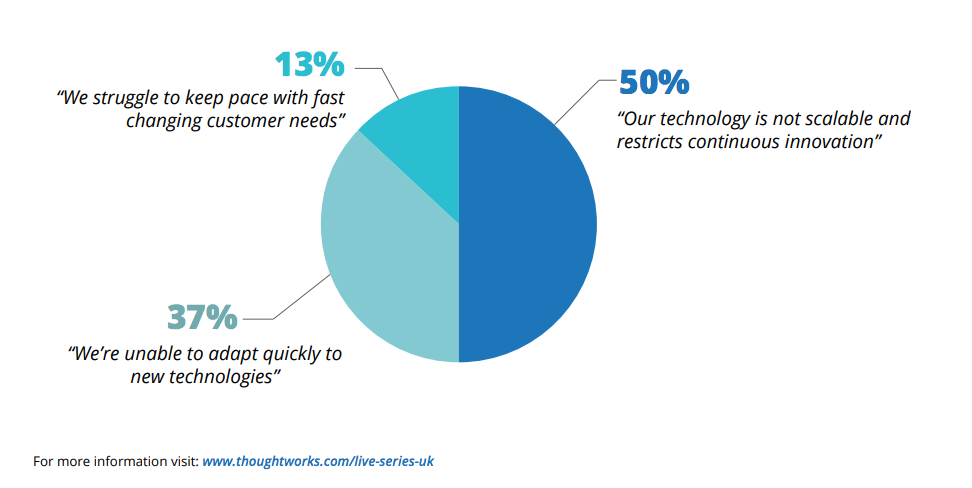
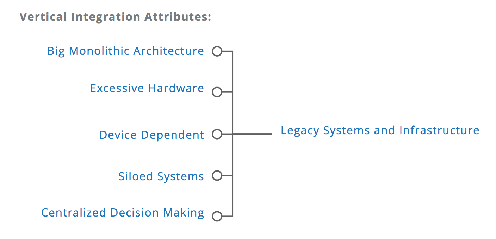
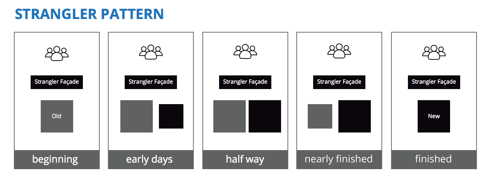

Legacy Modernisation
==========================

.. note::
  This is translation of https://www.thoughtworks.com/live-series-uk/content/legacy-modernisation
  
*  `INTRODUCTION`_
*  `WHAT DO WE MEAN BY LEGACY`_
* `THE HIDDEN LEGACY`_
* `THE ORIGINS OF INTERDEPENDENCE`_
* `THE STAGES OF LEGACY MODERNIZATION`_
  

INTRODUCTION
------------------

::

  如果你不了解遗产，你就无法创新。
  

遗产系统现代化是企业在未来的创新和竞争力方面能够进行的最重要的投资——它涉及的远远不止建立一个新的IT系统。

为什么现有企业难以应对敏捷的新竞争对手、不断变化的客户期望和潜在的颠覆性技术?当他们的市场开始变化，新的挑战和机遇出现时，为什么他们总是迟到?为什么他们看起来如此不愿意或无法创新?

它经常表现为管理或文化的欠缺: 自满、过度自信、缺乏意志或缺乏洞察力。这些解释构成了引人入胜的故事，充满了狂妄自大。然而，他们通常会忽略现任、继任者面临的主要因素: 其遗留系统。

遗留系统扼杀创新
^^^^^^^^^^^^^^^^^

遗留基础设施、遗留架构、遗留代码和遗留数据。这些约束使组织僵化，无情地增加了迁移和变更所涉及的成本和努力。

WHAT DO WE MEAN BY LEGACY
------------------------------

* 遗留代码:任何没有测试的代码
* 遗留基础设施:任何不安全、无弹性和不可伸缩的基础设施
* 遗留系统:任何不可见或不支持的COTS或定制系统
* 遗留体系结构:任何限制价值交付的体系结构
* 遗留流程:任何没有被度量的流程
* 遗留组织:任何不敏捷且不团结的组织
* 遗产思维:认为上述因素无法克服或改变

ThoughtWorks对来自42家英国和全球领先机构的72名高管进行了现场调查，其中65%的人认为，所在公司机构的技术阻碍了自己的发展。在这些受访者中，50%的人认为问题出在无法扩大规模和实现持续创新，37%的人说他们无法快速适应新技术，13%的人说他们难以跟上快速变化的客户需求。

遗留系统通过复杂性的不断增长引致有害的影响; 缺乏IT一致性意味着必须在系统中不断地进行类似的更改才能生效。它们通过已知的-未知的代码和数据耦合陷阱来麻痹计划:知道更改系统的一个元素将引致在系统中另一个看起来没有明显联系的区域中产生数千个bug和意想不到的结果。

遗产困境的一大讽刺之处在于，许多以这种方式苦苦挣扎的企业都有理由相信，它们把创新放在首位。他们绝不自满，而是仔细观察竞争对手开发的功能，确定客户想要的新功能，并准备投入大量时间和资源为自己开发这些功能——不管遗留系统给他们带来什么困难。然而，他们添加新功能、服务和应用程序的努力未能提供客户所追求的更深层次的价值——以及他们所要求的一致体验。这是因为系统的核心组件保持不变——并且对新接口实际能够交付的内容也带有相同的约束。

THE HIDDEN LEGACY
----------------------

The hidden legacy within most organizations
^^^^^^^^^^^^^^^^^^^^^^^^^^^^^^^^^^^^^^^^^^^^^^^^

遗留系统的核心组件包括业务本身, 这往往让业务觉得难以理解。与编码、数据和基础设施相比，组织的流程、组织架构和思想扮演着同样重要的角色。当遗留现代化被定义为一个IT问题时，它仍然是一个无法解决的问题。业务策略和计划是独立开发的，并被抛到IT实现的围墙之外。企业在没有真正理解需要围绕什么进行创新的情况下进行创新——这只会让事情变得更糟。

与遗留系统绑定的新应用程序会迅速增加系统的复杂性和依赖性。不顾一切地开发新功能的工作方法，使效率低下的工作方式根深蒂固。他们还把理解代码的精力集中在少数几个危险而不可或缺的工程师身上:他们是唯一知道如何在所有快速修复中完成任务的人。一致性被抛弃，体系变得比以往任何时候都更加棘手。就像蜘蛛网上的苍蝇一样，在职者越来越不顾一切地试图逃离遗留系统，这只会让它更快地陷入圈套。

唯一的解决方案是承诺停止开发并开始进行现代化——修复系统的基础，以使业务成为响应性强、敏捷的组织。这是一个充满挑战的过程——遗留问题有大量机会渗透并影响涌现的系统。然而，当企业致力于更广泛的组织变革时——当他们花时间理解业务和IT基础设施之间的真正相互作用时，这是一个可以有效导航的旅程。

THE ORIGINS OF INTERDEPENDENCE
-------------------------------------

A common legacy: The origins of interdependence
^^^^^^^^^^^^^^^^^^^^^^^^^^^^^^^^^^^^^^^^^^^^^^^^^^^^^^^

许多与遗留系统作斗争的企业都有一个共同的经历。它们是至上而下的垂直型组织，寻求控制整个供应链和价值链，其巨大的竞争优势来自规模经济。因此，他们部署了更强大的计算能力来管理非常具体的内部需求。系统以独特的方式耦合在一起，以满足业务的特定操作模型。例如，银行自动取款机的接口将以该银行特有的方式与其内部财务管理系统相关联。随着时间的推移，它的在线和移动银行应用程序将以类似的定制方式创建。超市的盘点系统将以反映特定超市历史的方式与收银台联系起来——而这在其他任何地方都是不合适的。

  
这些垂直整合的企业现在面临的问题是，它们所处的环境有利于横向扩展。他们的业务面临的破坏性威胁来自于客户的期望，即用户期望他们在生活中的某个领域的体验能够在其他领域得到复制。他们必须担心的竞争对手是那些足够敏捷企业，它们能够在不同的垂直领域提供这样的共同体验。这些企业自身的增长能力往往取决于通过收购和向新市场扩张实现横向扩张，而不是继续利用一个垂直的整体。

敏捷性和灵活性是构建响应性组织的关键——而这些大型和复杂企业的遗留系统尤其不适合交付它们。如果你只能像银行一样提供银行服务，那么当客户想要从即时通讯应用程序中获得同样的体验时，会发生什么呢?如果你只能像超市一样销售商品，那么当客户要求以与使用音乐流媒体服务相同的方式访问商品时会发生什么?

VERTICAL INTEGRATION
--------------------------

What happens when vertically integrated businesses modernize?
^^^^^^^^^^^^^^^^^^^^^^^^^^^^^^^^^^^^^^^^^^^^^^^^^^^^^^^^^^^^^^^^^^^^^^^

对遗留系统进行现代化的尝试遵循的实现曲线很容易以不作为告终。商业使现代化成为一项战略任务。这可能是由于竞争对手推出的新数字服务、用户对用户体验的负面反馈，或者市场对更快、更便宜的路线的需求日益明显。它的领导者不得不面对代码的混乱和一致性的匮乏，这需要时间和资源来解决。他们甚少去准备应对不适当的耦合及其带来的显著增加项目风险和不可预测性的问题。

依赖的程度和现代化的风险变得清晰,组织面临着一个非常没有吸引力的选择:放弃现代化改造，继续工作在现有系统的约束下；或把婴儿与洗澡水一起倒掉,把几十年的对现有基础设施的投资一笔勾销,放弃所谓的现有优势,从头再来。

THE STAGES OF LEGACY MODERNIZATION
------------------------------------------

A holistic approach to legacy modernization
^^^^^^^^^^^^^^^^^^^^^^^^^^^^^^^^^^^^^^^^^^^^^^^^^^^

事实上，遗留系统现代化并不意味着要在两个极端之间做出选择。从整体上看待现代化，组织可以为明智和有效的变革创造机会。它们可以从现有系统中提取价值，管理风险和影响，并增加成功的机会。要做到这一点，他们需要做的不仅仅是技术本身的现代化。他们需要检查业务存在的价值是什么，以及如何最好地创建它。

遗留系统现代化的整体方法有四个关键阶段，其将让企业能够把系统与战略相一致，制定现实的变革计划，通过共同的愿景激励团队，并将技术与真正的价值驱动力相一致，从而提供一个响应迅速的组织。

Stage 1: 充分理解需求和成本
"""""""""""""""""""""""""""""""""

成熟组织做出的最危险的假设之一是，其他业务将需要复制他们的技术和体系结构，以便与他们竞争。他们研究了自己在遗留系统上的投资，加上更新这些系统的成本，得出的结论是，进入他们行业的成本非常高。事实上，竞争对手只需要复制必要的基础设施部分来扰乱他们的业务——他们只需要专注于支持他们业务盈利方面的要素。在遗留系统中，这些元素只占整个基础设施的很小一部分。其结果是，进入壁垒远低于现任者的认识，而现代化的需要则更为迫切。

除了低估竞争威胁之外，遗留业务常常无法理解其系统随时间而恶化的方式。由于每个修复和新特性层都有额外的复杂性和依赖性，更新的痛苦和成本都将不可避免地会增加。拖延现代化是一种风险越来越大、代价越来越高的方法。

如果将遗留现代化视为需要由it解决的it问题，而不是将it、财务、产品管理、运营和组织作为一个整体来解决的业务问题，那么完全理解遗留现代化的需求和成本是不可能实现的。遗留现代化的重要起点包括询问现有系统在哪些地方为业务增加价值，以及它们在哪些地方削弱价值。这有助于突出需要发生的更广泛的组织变革。

Stage 2: 围绕价值定位现代化
""""""""""""""""""""""""""""""""""

一个现代化的系统需要迎合所有的用户——并复制所有的功能——这是一个自然的假设。然而,这是一个假设经常破坏整个遗留系统现代化的目的。遗留系统现代化并不是说要以一种更快、更有效的方式来做业务，而是一个围绕企业现在和未来需要做什么的重新定位的例子。这必须从分析真正的价值开始。

遗留系统应适应有利可图的客户，以及构建支撑客户这种盈利能力的业务模式和职能。在大多数情况下，这需要把重点放在顾客真正看重的体验上。通过在新系统的设计中采用新的项目思维，组织可以关注他们需要什么，而不是他们已经拥有什么。突出这些真实需求与现有系统之间的共同点，可以确定哪些需要保留，哪些需要丢弃。

Stage 3: 在不损害未来的前提下，保留现有体系的价值
"""""""""""""""""""""""""""""""""""""""""""""""""

在澳大利亚的一次旅行中，著名作家兼软件顾问马丁·福勒被一种壮观的“扼杀者”无花果所震撼，他看到这种无花果在树的上部的树枝上播种，然后沿着树干生长，然后勒死了它们的主人。他突然想到，这为更新遗留软件提供了一种模式。马丁·福勒所推广的“扼杀者模式”是围绕遗留系统外层构建新系统的一种方式，然后可以将遗留系统杀死并移除，使其远离新改进系统。

在特定的环境中，当需要更新具有一定价值的遗留软件组件时， 扼杀者模式具有真正的价值。但是，它也可能导致一种危险的倾向，即将新系统的设计扎根于前一个系统而限制了新系统的设计。当组织误解了扼杀者模式时，他们常常寻求将其应用于整个业务领域。当扼杀器模式围绕着它们要替换的遗留系统设计时，它们就会阻碍了有意义的改变。特别是，它们通常植根于与原始系统相同的、未现代化的数据集——并且依赖于许多相同的供应商关系。

现代化体系结构和技术的设计需要与业务策略保持一致，而不是与以前的系统保持一致。着眼于业务寻求的价值，开发架构可以提供一个清晰的映射，然后根据它开发不同的元素。关键是要清楚组件在新架构中应该如何协同工作，而不是它们在过去如何协同工作。然后，现代化可以为系统的每个组件应用最合适的方法。在旧系统中有真正的价值需要保留的地方，很可能按比例缩小的被包括进扼杀器模式中。

Stage 4: 实事求是地执行——获得最大的成功机会
""""""""""""""""""""""""""""""""""""""""""""""

