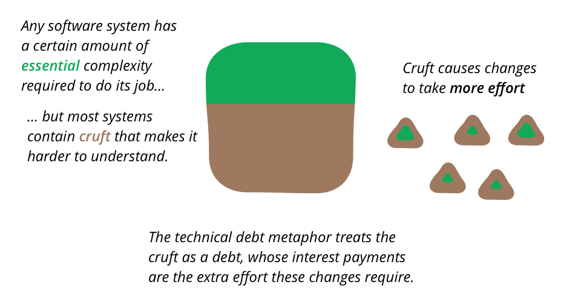

TechnicalDebt
=============

软件系统很容易积累缺陷——内部质量上的缺陷使得进一步修改和扩展系统比理想情况下更加困难。技术债务是一个由Ward Cunningham创造的隐喻，它描述了如何处理这一问题，把它看作是一种金融债务。添加新功能所需要的额外努力是为债务支付的利息。

  
假设我的代码库中有一个令人困惑的模块结构。我需要添加一个新功能。如果模块结构是清晰的，那么我将花费4天的时间来添加这个特性，但是因为这个繁碎点，我将花费6天的时间。这两天的差额是债务的利息。

债务这个比喻最吸引我的地方，是它如何框定了我对如何处理这一问题的看法。我可能需要5天时间来清理模块化结构，去掉那个繁碎点，也就是说还清本金。如果我只是为了这一个功能而这么做，那没有任何好处，因为我将花费九天而不是六天的时间。但如果我有两个类似的功能，那么我将会更快地清除障碍。

这样说，这听起来像一个处理数字的简单问题，任何使用电子表格的经理都应该能找出选项。遗憾的是，由于我们无法衡量生产率，这些成本都无法客观地衡量。我们可以估计完成一个功能需要多长时间，估计如果去掉了这个功能，可能会是什么样子，以及估计去掉这个功能的成本。但我们对这些估计的准确性相当低。

考虑到这一点，通常最好的办法就是像处理金融债务一样，逐步偿还本金。在第一个特性中，我将花费额外的几天时间来删除一些冗余。这可能足以将未来的利率提高到一天。这仍然需要额外的时间，但是通过去掉这段代码，我可以降低将来修改这段代码的成本。这种渐进式改进的最大好处是，它自然意味着我们要花费更多的时间来删除那些频繁修改的区域中的繁碎点，而这些区域正是代码库中最需要清理的区域。

把这看作是付息与还本付息的对比，可以帮助决定处理哪些冗余。如果我的代码库中有一个糟糕的区域，如果我不需要修改它，那就不是问题。我只在必须使用软件的那个部分时才触发利息支付(这是比喻失效的地方，因为财务利息支付是由时间触发的)。因此，代码的一些简单但稳定的区域可以不受影响。相比之下，高活动地区需要对冗余点采取零容忍态度，因为利息支付高得惊人。这一点尤其重要，因为当开发人员在不注意内部质量的情况下进行更改时，冗余点就会累积起来——更改越多，冗余累积的风险就越大。

债务的隐喻有时被用来作为忽视内部质量的理由。其论点是，阻止冗余的形成需要时间和精力。如果有迫切需要的新特性，那么最好承担债务，接受未来必须管理这些债务的事实。

这里的危险在于，大多数时候这种分析都做得不好。冗余具有快速的影响，可以快速地降低所需的新特性。这样做的团队最终会用完所有的信用，但交付的时间仍然比他们在提高内部质量方面所做的努力要晚。在这里，这个比喻往往会让人们误入歧途，因为这种动力与金融贷款的动力并不匹配。只有当你保持在 `DesignStaminaHypothesis <https://martinfowler.com/bliki/DesignStaminaHypothesis.html>`_ 的设计回报线以下，并且团队在几周内而不是几个月内达到这条线时，才可以通过举债来加速交付。

对于不同种类的债务是否应被视为债务，人们经常展开辩论。我发现，考虑一下这些债务是有意为之的，还是无意中产生的，这对我很有帮助——这让我进入了 `技术债务象限 <https://martinfowler.com/bliki/TechnicalDebtQuadrant.html>`_ 。

进一步的阅读
^^^^^^^^^^^

* 据我所知，Ward在1992年 `OOPSLA <http://c2.com/doc/oopsla92.html>`_ 经验报告中首次引入了这个概念。 `维基 <http://wiki.c2.com/?ComplexityAsDebt>`_ 上也讨论过这个问题。
* 沃德·坎宁安(Ward Cunningham)在一段 `视频 <https://www.youtube.com/watch?v=pqeJFYwnkjE>`_ 中讨论了他创造的这个比喻。
* 戴夫•尼科莱特(Dave Nicolette)对沃德关于技术债务的观点进行了扩展，并对我所说的债务象限进行了很好的 `案例研究 <http://neopragma.com/index.php/2019/03/30/technical-debt-the-man-the-metaphor-the-message/>`_
* 一些读者也发来了一些类似的好名字。David Panariti将丑陋的编程称为赤字编程。显然，他最初是在几年前开始使用这个词的，当时它符合政府的政策;我想现在又很自然了。
* 斯科特·伍德建议:“当当前的技术水平超过了产品的基础水平，以至于开始失去与行业的兼容性时，技术膨胀就可以被看作是一种损失。”这样的例子在语言的版本中会落后，以至于你的代码不再与主流编译器兼容。”
* 史蒂夫•麦康奈尔(Steve McConnell)在这个比喻中提出了几个很好的 `观点 <http://www.construx.com/10x_Software_Development/Technical_Debt/>`_，尤其是当你有意降低债务时，如何让你有更多的空间有意地承担债务。我也喜欢他的最低支付的概念(相对于web站点，这对于解决嵌入式系统的问题来说是非常高的)。
* 阿伦·埃里克森谈论 `安然的融资 <http://www.informit.com/articles/article.aspx?p=1401640>`_ 。
*  `Henrik Kniberg <http://blog.crisp.se/2013/10/11/henrikkniberg/good-and-bad-technical-debt>`_ 认为，造成最大问题的是较老的技术债务，而设定一个定性债务上限是明智的，可以帮助管理这一问题。
* Erik Dietrich讨论了 `技术债务 <http://www.daedtech.com/human-cost-tech-debt/>`_ 的人力成本:团队内斗、技能萎缩和人员流失。

修正
^^^^

我最初是在2003年10月1日发表这篇文章的。我在2019年4月对它进行了彻底的重写。
