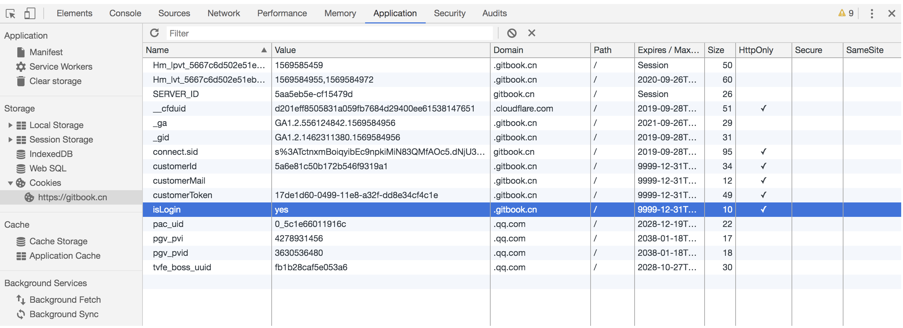
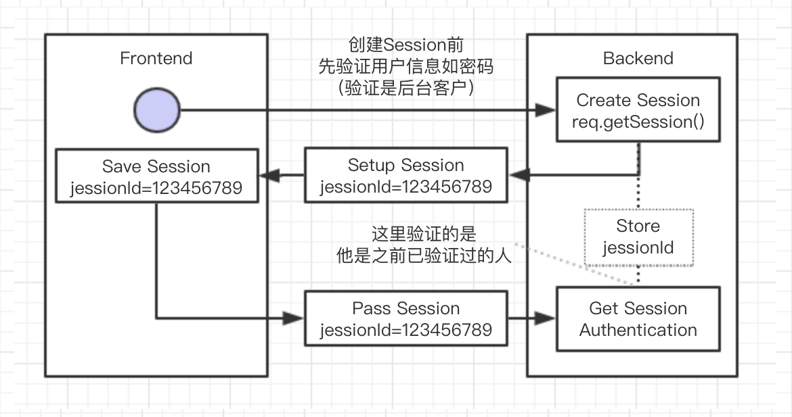

Cookie、Session认证
==========================

* `HTTP Cookie`_
* `Authentication认证`_

  * `Protential problem`_
  * `Alternative`_

* `Other Reference`_

```````````````````````````````

HTTP Cookie
---------------
（也叫Web Cookie或浏览器Cookie）是服务器发送到用户浏览器并保存在本地的一小块数据，它会在浏览器下次向同一服务器再发起请求时被携带并发送到服务器上。

**Cookie key elements：**

* Name/Value：基本的键值对
* Domain: Cookie的作用域
* HttpOnly: 是否只是http协议使用。只能在后端通过getCookies()获取，js不能获取
* Size: Max 5M
* Expiry:

  - expiry=-1，代表浏览器关闭后，cookie就失效了；
  - expiry>0，代表会将cookie保存到硬盘中，直到设置时间过期才会被浏览器自动删除；
  - expiry=0，删除cookie，cookie都会被浏览器给删除。


  


Authentication认证
--------------------------

简单来说，服务器端获取Session并保存Id，然后同样返回并保存在客户端的Cookie，后续校验客户端带来的Id与服务器本地比较作验证




Protential problem
^^^^^^^^^^^^^^^^^^^^^^^

* 上面提及，使用Cookie对于网络等的消耗不太适合移动端
* 另外，由上图可以看出，后端需要把sessionId都存起来作后续验证使用。当用户访问量大的时候对后端的压力就会很大，如果存DB的话I/O读写会很慢，如果存Redis并且加上load balance的话可以解决速度问题。当然，万一redis或者load balance机制出问题，还是会丢失信息需要用户重新登陆。


Alternative
^^^^^^^^^^^^^^^
由于服务器指定Cookie后，浏览器的每次请求都会携带Cookie数据，会带来额外的性能开销（尤其是在移动环境下）。新的浏览器API已经允许开发者直接将数据存储到本地，如使用 `Web Storage`_ API （本地存储和会话存储）或 IndexedDB 。


**Web Storage**

https://developer.mozilla.org/zh-CN/docs/Web/API/Web_Storage_API

* **Window.sessionStorage** 为每一个给定的源（given origin）维持一个独立的存储区域，该存储区域在页面会话期间可用（即只要浏览器处于打开状态，包括页面重新加载和恢复）。
* **Window.localStorage** 同样的功能，但是在浏览器关闭，然后重新打开后数据仍然存在。
* 从Firefox 45开始，当浏览器崩溃或重启时，每个源的存储大小将限制在10M，以避免因过度使用web storage引起的内存问题

**Indexed DB**

Refer: https://developer.mozilla.org/zh-CN/docs/Web/API/IndexedDB_API


Other Reference
----------------------

* https://mp.weixin.qq.com/s?__biz=MzA5Njc2OTg4NQ==&mid=2247483703&idx=1&sn=fd9984e2e7c6aee7429f261697dfacbd&chksm=90aa4305a7ddca13fcc28fd6266b0e19ad1961a79387b89f213f5b6f93beef5ad06a2cc8916e&scene=21#wechat_redirect


.. index:: Cookie, Authentication, Microservices
 
