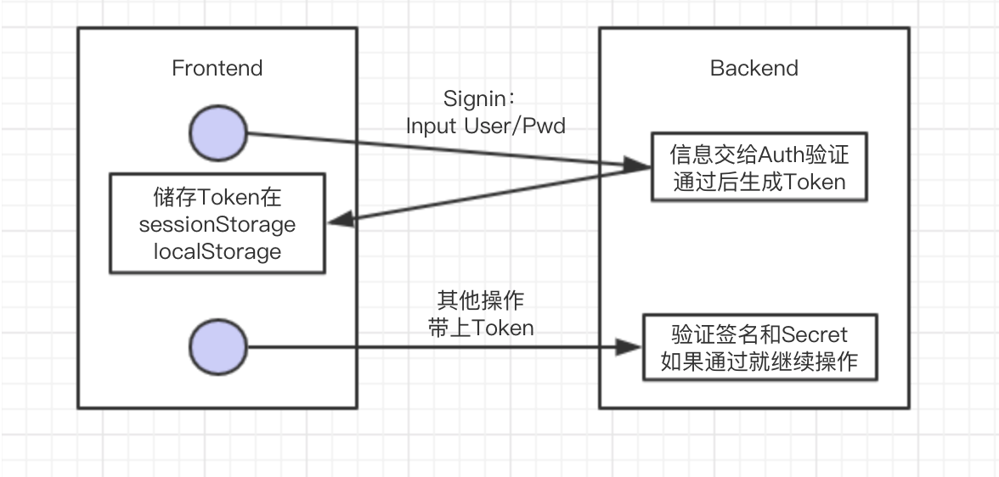

JWS、Token认证
===================

* `JWT Basic`_

  * `Header`_
  * `Payload`_
  * `Signature`_

* `Authentication`_

  * `大致流程`_
  * `代码实现`_
 
* `Reference`_


``````````````````````


JWT Basic
------------

JWT 的全称是 JSON Web Token. 由三部分组成: Header.Payload.Signature 

Header
^^^^^^^^^^

* alg: algorithm, 默认是 HMAC SHA256
* 在传输前会对内容进行Base64Url转换

.. code-block:: json
  
  {
    "alg": "HS256", 
    "typ": "JWT" 
  }

Payload
^^^^^^^^^^

.. code-block:: json
  
  {
    "sub": "1234567890",
    "name": "John Doe",
    "admin": true
  }


默认field可称为claim(也可以添加私有field，如上),在传输前会对内容进行Base64Url转换

* iss (issuer)：签发人
* exp (expiration time)：过期时间
* sub (subject)：主题
* aud (audience)：受众
* nbf (Not Before)：生效时间
* iat (Issued At)：签发时间
* jti (JWT ID)：编号


Signature
^^^^^^^^^^^^^^

根据Header中指定的算法，对Header和Payload进行加密，然后把Base64Url转换后的header.payload.signature并合为JWT。


Authentication
-----------------------

上面所说的，JWT只是一个token的形式， 综合运用了Encoding（Base64）和Signature。

大致流程
^^^^^^^^




这方法可以应对Cookie、Session认证时提到的两个主要问题:

* 作为cookie的替换，可以把生成的JWT保存在如sessionStorage。
* 为服务器端无状态，把JWT 3个部分都整体的发送并保存在客户端，客户端再访问的时候又原样带回来做验证。


代码实现
^^^^^^^^^

Pom.xml

.. code-block:: xml
 
 <dependency>
  <groupId>com.auth0</groupId>
  <artifactId>java-jwt</artifactId>
  <version>3.8.3</version>
 </dependency>

JWTUtil.java

.. code-block:: java
 
 package com.github.abigail830.jwtdemo.infrastructure;

 import com.auth0.jwt.JWT;
 import com.auth0.jwt.JWTVerifier;
 import com.auth0.jwt.algorithms.Algorithm;
 import com.auth0.jwt.exceptions.JWTCreationException;
 import com.auth0.jwt.exceptions.JWTVerificationException;
 import java.util.Date;
 import static com.github.abigail830.jwtdemo.infrastructure.Constant.EXPIRATION_TIME;
 
 public class JWTUtil {
    
    private static final String SECRET = "Secret";

    public String sign() {
        try{
            return JWT.create()
                    .withSubject("SaraQian")
                    .withIssuer("jwt-demo")
                    .withExpiresAt(new Date(System.currentTimeMillis() + EXPIRATION_TIME))
                    .sign(Algorithm.HMAC512(SECRET));
        }catch (JWTCreationException exception){
            System.out.println("Invalid signature/claims");
            return null;
        }
    }

    public String verify(String token){
        try {
            Algorithm algorithm = Algorithm.HMAC512(SECRET);
            JWTVerifier verifier = JWT.require(algorithm)
                    .build();
            return verifier.verify(token).getSubject();

        } catch (JWTVerificationException exception){
            System.out.println("Invalid signature/claims");
            return null;
        }
    }
 }

这里verify的时候返回的是Subject部分，其实可以取claim的任意信息，比如Issuer。

**简单验证签名**

* 如果verify过程中没有抛出exception，也没有过期，也可以进一步校验取出的claim部分是否正确，如issuer是否“jwt-demo”等
* 如果全部校验通过，则承认这是之前已经经过认证和签名的客户，正常通过进行后续操作。
* 从而，通过验证签名去证明“你是你”，而没有在后端储存任意其他信息。

**复杂验证**

* 后台也可以在第一次签名的时候就把用户信息和token对应关系存起来，做进一步校验。


Reference
-------------

* JWT Debugger tools: https://jwt.io/
* Demo: https://dzone.com/articles/spring-boot-security-json-web-tokenjwt-hello-world

.. index:: Authentication

