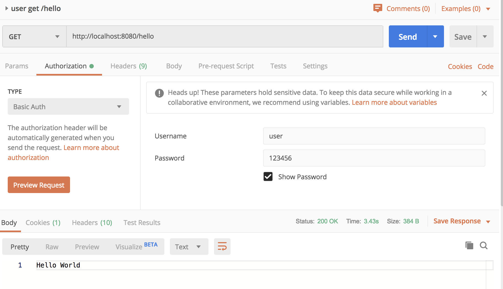

SpringBoot Security(2)
==========================

Generally, we would not hardcode user/password but would store it and config in DB and may also further load in Redis. So here is another example with DB connection.

Development part
-----------------------

Step1. Prepare DB
^^^^^^^^^^^^^^^^^^^^^^

Table User and Role, and also User_Role which is for the 1-N mapping between them. Also, we could prepare some dummy data in it. Please note the RoleName need to be start with "ROLE_" and also password is MD5 encrypted.

.. code-block:: sql
  
  create TABLE `user` (
    `id` bigint(11) NOT NULL AUTO_INCREMENT,
    `user_name` varchar(255) NOT NULL,
    `password` varchar(255) NOT NULL,
    PRIMARY KEY (`id`)
  );
  create TABLE `role` (
    `id` bigint(11) NOT NULL AUTO_INCREMENT,
    `name` varchar(255) NOT NULL,
    PRIMARY KEY (`id`)
  );
  create TABLE `user_role` (
    `user_id` bigint(11) NOT NULL,
    `role_id` bigint(11) NOT NULL
  );
  
  insert into user (user_name, password) VALUES ('user','e10adc3949ba59abbe56e057f20f883e');
  insert into user (user_name , password) VALUES ('admin','e10adc3949ba59abbe56e057f20f883e');
  insert into role (name) values ('ROLE_USER');
  insert into role (name) values ('ROLE_ADMIN');
  insert into user_role (user_id, role_id) values (1, 1);
  insert into user_role (user_id, role_id) values (2, 2);
  

Step2. Prepare Entity and Mappper (Assume using mybatis)
^^^^^^^^^^^^^^^^^^^^^^^^^^^^^^^^^^^^^^^^^^^^^^^^^^^^^^^^^^^^^^

注意，在Entity里面实现了特殊的继承

**RoleEntity.java**

.. code-block:: java
  
  @Getter
  @Setter
  @ToString
  @AllArgsConstructor
  @NoArgsConstructor
  public class RoleEntity implements GrantedAuthority {

    private Long id;
    private String name;

    @Override
    public String getAuthority() {
        return name;
    }
  }

**UserEntity.java**

.. code-block:: java
  
  @ToString
  @Setter
  @Getter
  public class UserEntity implements UserDetails, Serializable {

    private Long id;
    private String userName;
    private String password;
    private List<RoleEntity> authorities;

    public User toUser(){
        return new User(id, userName, password);
    }
    @Override
    public Collection<? extends GrantedAuthority> getAuthorities() {
        return authorities;
    }

    @Override
    public String getPassword() {
        return this.password;
    }

    @Override
    public String getUsername() {
        return this.userName;
    }

    @Override
    public boolean isAccountNonExpired() {
        return true;
    }

    @Override
    public boolean isAccountNonLocked() {
        return true;
    }

    @Override
    public boolean isCredentialsNonExpired() {
        return true;
    }

    @Override
    public boolean isEnabled() {
        return true;
    }

    public Long getId() {
        return id;
    }
  }

**RoleMapper.java**

.. code-block:: java
  
  @Mapper
  public interface RoleMapper {
    @Select("SELECT * " +
            "FROM ROLE " +
            "LEFT JOIN USER_ROLE on USER_ROLE.role_id = ROLE.id " +
            "WHERE id = '${id}'")
    List<RoleEntity> getRolesByUserId(Long id);
  }

**UserMapper.java**

.. code-block:: java
  
  @Mapper
  public interface UserMapper {
    @Select("SELECT * FROM USER WHERE USER_NAME = '${userName,jdbcType=VARCHAR}'")
    UserEntity loadUserByUsername(String userName);

    @Select("SELECT * FROM USER")
    List<UserEntity> getAllUserEntity();
  }

Step3. Config UserDetailServer
^^^^^^^^^^^^^^^^^^^^^^^^^^^^^^^^^^^^^^

CustomUserService, we need this implements UserDetailsService, it would be called for get user info from DB(or memory) for further verification.

.. code-block:: java
  
  @Service
  @Slf4j
  public class CustomUserService implements UserDetailsService {

    @Autowired
    UserRepositoryImpl userRepository;

    @Override
    public UserDetails loadUserByUsername(String userName) throws UsernameNotFoundException {
        final UserEntity userEntityByName = userRepository.getUserByName(userName);
        if(userEntityByName == null){
            throw new UsernameNotFoundException("UserEntity name not found");
        }else{
            final List<RoleEntity> roleByUserId = userRepository.getRoleByUserId(userEntityByName.getId());
            userEntityByName.setAuthorities(roleByUserId);
        }
        log.debug("UserEntity found : {}", userEntityByName);
        return userEntityByName;
    }
  }

Step4. Config WebSecurityConfig
^^^^^^^^^^^^^^^^^^^^^^^^^^^^^^^^^^^^^

WebSecurityConfig, 2 major usage:

* **Authentication:** One is to config userDetailsService in the authentication flow. And during this, we need to config the password Encoder as well. It would be used during authentication
* **Authorization:** Config the access right, said diff URL map to diff authority right.

.. code-block:: java
  
  @Configuration
  public class WebSecurityConfig extends WebSecurityConfigurerAdapter {

    @Autowired
    CustomUserService customUserService;

    @Override
    protected void configure(AuthenticationManagerBuilder auth) throws Exception {
        auth.userDetailsService(customUserService).passwordEncoder(new PasswordEncoder() {
            //对密码进行加密
            @Override
            public String encode(CharSequence charSequence) {
                System.out.println(charSequence.toString());
                return DigestUtils.md5DigestAsHex(charSequence.toString().getBytes());
            }
            //对密码进行判断匹配
            @Override
            public boolean matches(CharSequence charSequence, String s) {
                String encode = DigestUtils.md5DigestAsHex(charSequence.toString().getBytes());
                boolean res = s.equals( encode );
                return res;
            }
        });
    }

    @Override
    protected void configure(HttpSecurity http) throws Exception {
        http
                .csrf().disable()
                .formLogin().disable()
                .httpBasic()
                .and()
                .authorizeRequests()
                .antMatchers("/hello").hasRole("USER")
                .antMatchers("/user").hasRole("USER")
                .antMatchers("/hello-admin").hasRole("ADMIN");
    }
  }

Testing
-------------

假设，controller里面只提供了3个API：

* GET /hello
* GET /hello-admin
* GET /user

With postman
^^^^^^^^^^^^^^^

Input the user/password into Authentication tab.

When checking in the console, we could see this part(user:123456) would be base64 encoded like:

  Authorization: Basic dXNlcjoxMjM0NTY=
  
当postman不设置authentication的时候，会得到401的结果
  
  {
    "timestamp": "2019-11-11T08:05:13.455+0000",
    "status": 401,
    "error": "Unauthorized",
    "message": "Unauthorized",
    "path": "/hello"
  }

