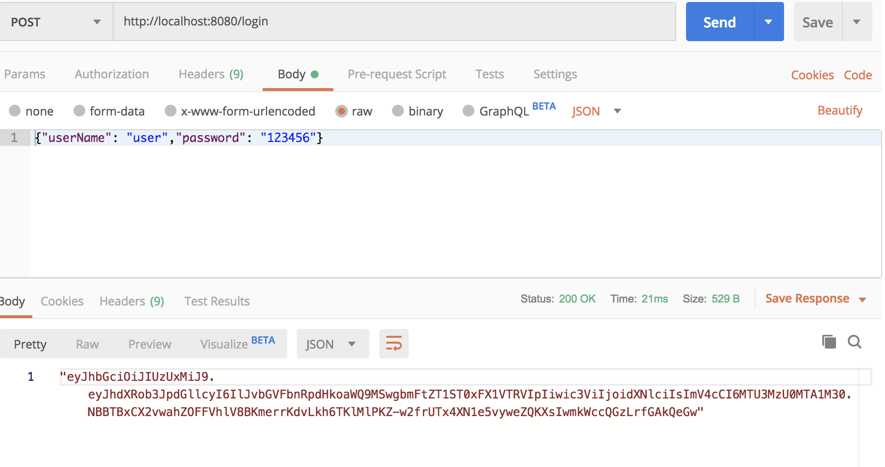
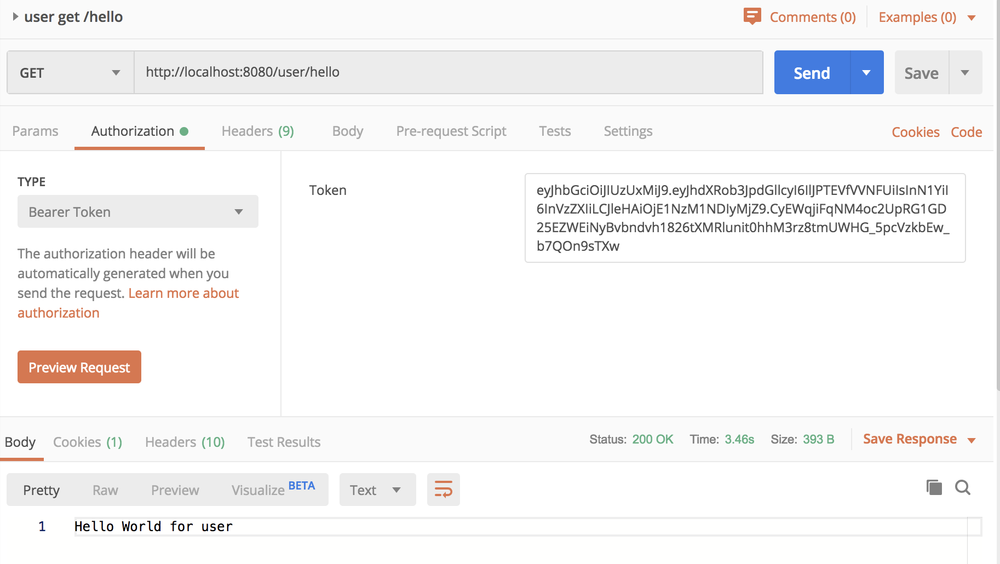

SpringBoot Security(3)
===========================

在之前的例子1、2中，一直是使用username/password进行校验，也就是说用户的请求，都需要带上这些信息，然后服务端每次都对这些信息进行比对和校验。这种就是有状态的校验服务。它的缺陷包括：

* 服务端保存大量数据，增加服务端压力
* 服务端保存用户状态，不支持集群化部署

无状态登录的流程
------------------
* 首先客户端发送账户名/密码到服务端进行认证
* 认证通过后，服务端将用户信息加密并且编码成一个token，返回给客户端
* 以后客户端每次发送请求，都需要携带认证的token
* 服务端对客户端发送来的token进行解密，判断是否有效，并且获取用户登录信息

其中，这里的token可以使用JWT Token（具体可以参考JWT的文章）

所以，这里基于例子2，新增加了JwtLoginFilter & JwtVerifyFilter去实现上面提到的流程

.. image:: ../../../images/auth2.png
  :width: 500px
  

代码实现
---------------

**JwtLoginFilter.java**

.. code-block:: java
  
  public class JwtLoginFilter extends AbstractAuthenticationProcessingFilter {

    //this is base64 for 'password' as seed
    public static final String SEED = "cGFzc3dvcmQ=";

    protected JwtLoginFilter(String defaultFilterProcessesUrl, AuthenticationManager authenticationManager) {
        super(new AntPathRequestMatcher(defaultFilterProcessesUrl));
        setAuthenticationManager(authenticationManager);
    }

    @Override
    public Authentication attemptAuthentication(HttpServletRequest req, HttpServletResponse resp) throws AuthenticationException, IOException, ServletException {
        User user = new ObjectMapper().readValue(req.getInputStream(), User.class);
        return getAuthenticationManager().authenticate(new UsernamePasswordAuthenticationToken(user.getUserName(), user.getPassword()));
    }

    @Override
    protected void successfulAuthentication(HttpServletRequest req, HttpServletResponse resp, FilterChain chain, Authentication authResult) throws IOException, ServletException {
        Collection<? extends GrantedAuthority> authorities = authResult.getAuthorities();
        StringBuffer as = new StringBuffer();
        as.append(authorities.stream()
                .map(auth->((GrantedAuthority) auth).getAuthority())
                .collect(Collectors.joining(",")));

        String jwt = Jwts.builder()
                .claim("authorities", as)//配置用户角色
                .setSubject(authResult.getName())
                .setExpiration(new Date(System.currentTimeMillis() + 10 * 60 * 1000))
                .signWith(SignatureAlgorithm.HS512, SEED)
                .compact();
        resp.setContentType("application/json;charset=utf-8");

        PrintWriter out = resp.getWriter();
        out.write(new ObjectMapper().writeValueAsString(jwt));
        out.flush();
        out.close();
    }

    protected void unsuccessfulAuthentication(HttpServletRequest req, HttpServletResponse resp, AuthenticationException failed) throws IOException, ServletException {
        resp.setContentType("application/json;charset=utf-8");

        PrintWriter out = resp.getWriter();
        out.write("登录失败!");
        out.flush();
        out.close();
    }
  }

**JwtVerifyFilter.java**

.. code-block:: java
  
  @Slf4j
  public class JwtVerifyFilter extends GenericFilterBean {

    @Override
    public void doFilter(ServletRequest servletRequest,
                         ServletResponse servletResponse,
                         FilterChain filterChain) throws IOException, ServletException {

        HttpServletRequest req = (HttpServletRequest) servletRequest;
        String jwtToken = req.getHeader("authorization");

        if(jwtToken != null && jwtToken.contains("Bearer")){
            logger.debug(jwtToken);
            Claims claims = Jwts.parser()
                    .setSigningKey(JwtLoginFilter.SEED)
                    .parseClaimsJws(jwtToken.replace("Bearer", ""))
                    .getBody();

            String username = claims.getSubject();//获取当前登录用户名
            List<GrantedAuthority> authorities =
                    AuthorityUtils.commaSeparatedStringToAuthorityList((String) claims.get("authorities"));
            UsernamePasswordAuthenticationToken token = new UsernamePasswordAuthenticationToken(username, null, authorities);
            SecurityContextHolder.getContext().setAuthentication(token);

            filterChain.doFilter(req, servletResponse);
        }else{
            servletResponse.setContentType("application/json;charset=utf-8");

            PrintWriter out = servletResponse.getWriter();
            out.write("登录失败!");
            out.flush();
            out.close();
        }
    }
  }

同时在WebSecurityConfig.java里面把filter配置进去调用链

.. code-block:: java
  
    @Override
    protected void configure(HttpSecurity http) throws Exception {
        http.csrf().disable()
                .formLogin().disable()
                .httpBasic()
                .and()
                .authorizeRequests()
                .antMatchers("/user/*").hasRole("USER")
                .antMatchers("/admin/*").hasRole("ADMIN")
                .antMatchers(HttpMethod.POST, "/login").permitAll()
                .and()
                .addFilterBefore(new JwtLoginFilter("/login",authenticationManager()),
                        UsernamePasswordAuthenticationFilter.class)
                .addFilterBefore(new JwtVerifyFilter(),UsernamePasswordAuthenticationFilter.class);
    }

测试
---------

使用/login获取token

然后尝试访问GET /user/hello, 不配置token的话，会得到“登录失败!”

.. index:: Microservices, 
