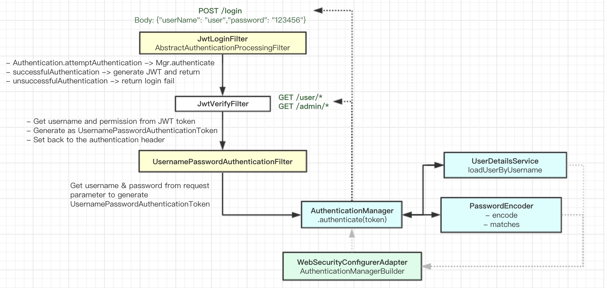

SpringBoot Security(3)
===========================

在之前的例子1、2中，一直是使用username/password进行校验，也就是说用户的请求，都需要带上这些信息，然后服务端每次都对这些信息进行比对和校验。这种就是有状态的校验服务。它的缺陷包括：

* 服务端保存大量数据，增加服务端压力
* 服务端保存用户状态，不支持集群化部署

无状态登录的流程
------------------
* 首先客户端发送账户名/密码到服务端进行认证
* 认证通过后，服务端将用户信息加密并且编码成一个token，返回给客户端
* 以后客户端每次发送请求，都需要携带认证的token
* 服务端对客户端发送来的token进行解密，判断是否有效，并且获取用户登录信息

其中，这里的token可以使用JWT Token（具体可以参考JWT的文章）

  
  
