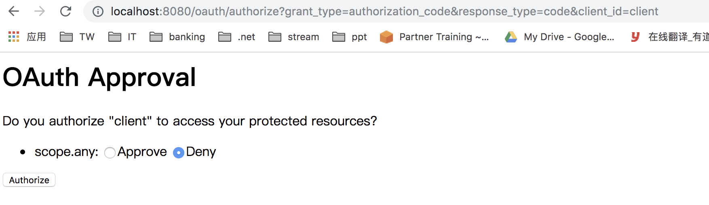
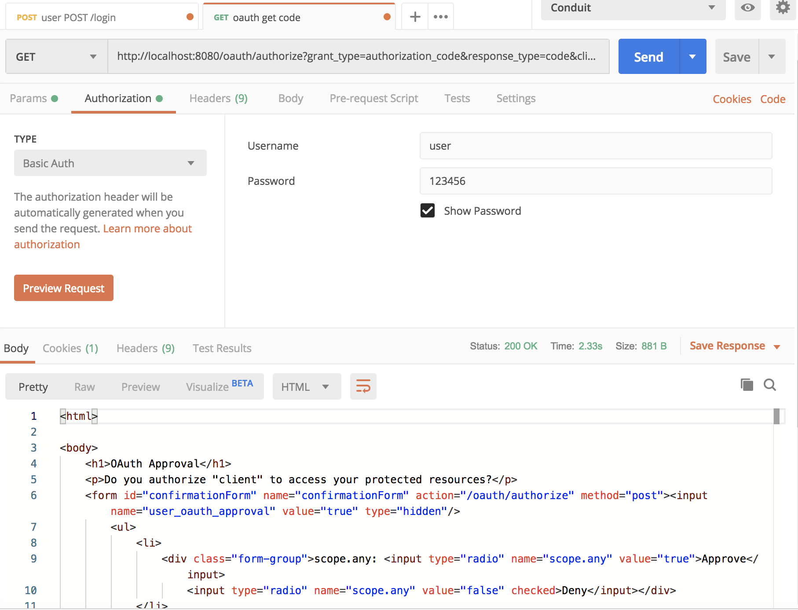

Spring Security OAuth(2)
==========================

Authentication Config
^^^^^^^^^^^^^^^^^^^^^^^^^^

.. code-block:: java
  
  @Configuration
  public class AuthServerConfig extends AuthorizationServerConfigurerAdapter {

    @Autowired
    MD5PasswordEncoder md5PasswordEncoder;

    @Override
    public void configure(ClientDetailsServiceConfigurer clients) throws Exception {
        clients
                .inMemory()
                .withClient("client")
                .secret(md5PasswordEncoder.encode("123456"))
                .scopes("any")
                .authorizedGrantTypes("authorization_code")
                .redirectUris("http://localhost:8181/hello");
    }
  }
  
Remark: Other user related config refer to SpringSecurity 1/2/3 series first.

Test
^^^^^^

1. Trigger: http://localhost:8080/oauth/authorize?grant_type=authorization_code&response_type=code&client_id=client

Auth screen would be shown

2. If already login, it would be redirect back to the specified URL

http://localhost:8181/hello?code=rEpnEY

If using Postman, we could see the same(but remember to set user/123456 in Authentication tab

.. index:: Microservices, SpringBoot
