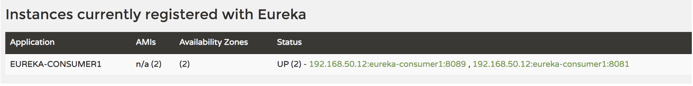

Load Balance Client (1)
==========================

有多种方式基于服务注册与发现机制去进一步实现负载均衡

DiscoveryClient
----------------------

Startup client as HOT-HOT
^^^^^^^^^^^^^^^^^^^^^^^^^^^^^^^^^

首先，作为client，可以创建两个instance HOT-HOT模式，这个只需要配置application.yml,令spring.application.name使用相同的名字

**Consumer1:**

.. code-block:: yaml
  
  spring:
    application:
      name: eureka-consumer1
    eureka:
      instance:
        hostname: consumer1
  server:
    port: 8081

**Consumer2:**

.. code-block:: yaml
  
  spring:
    application:
      name: eureka-consumer1
    eureka:
      instance:
        hostname: consumer2
  server:
    port: 8089

当两个instance起来之后，观察eureka-server,会看到只注册了一行：

在这个服务里面能够提供一个GET接口，被调用的时候，会打印日志并显示自己的名字（spring.application.name)

.. code-block:: java
  
  @RestController
  @RequestMapping("/name")
  public class NameController {

    @Value("${spring.application.name}")
    String name;

    @GetMapping
    public String getName(){
        System.out.println("Receive naming request");
        return "Here is Eureka-Client With DiscoveryClient: "+name ;
    }
  }

Discovery Client Test
^^^^^^^^^^^^^^^^^^^^^^^^

另外一边，我们可以尝试用discovery client去调用上面2个instance的/name接口

**DiscoveryController.java**

.. code-block:: java
  
  @RestController
  @Slf4j
  public class DiscoveryController {

    @Autowired
    DiscoveryService discoveryService;

    @GetMapping("/discovery/{providerName}")
    public String discoveryProviderName(@PathVariable String providerName){
        return discoveryService.getProviderName(providerName);
    }
  }

**DiscoveryService.java**

.. code-block:: java
  
  @Service
  @Slf4j
  public class DiscoveryService {

    @Autowired
    private DiscoveryClient discoveryClient;

    public String getProviderName(String providerName){
        RestTemplate restTemplate = new RestTemplate();
        final List<ServiceInstance> instances = discoveryClient.getInstances(providerName);
        if(!instances.isEmpty()){
            final ServiceInstance serviceInstance = instances.get(0);
            String url = serviceInstance.getUri()+"/name";
            return restTemplate.exchange(url, HttpMethod.GET,null,String.class).getBody();
        }
        return "";
    }
  }

这时候多次调用http://localhost:8081/discovery/eureka-consumer1，会发现虽然都是返回“Here is Eureka-Client With DiscoveryClient: eureka-consumer1”，但其实两个consumer 实例会分别打印日志，表示是不同的实例在做回应

但是，仔细看DiscoveryService里面的处理，并不优雅。discoveryClient.getInstances的时候，会根据这个名字，从EurekaServer里面获取整个地址list并获得列表中的第一个地址进行访问。也就是说，客户端需要自己去处理选择逻辑。比如说轮询，还是固定其中一个等等。 这样客户端需要处理的逻辑比较多（当然也可以说是自由度比较大）

.. index:: Microservices, Springboot, Load Balance
