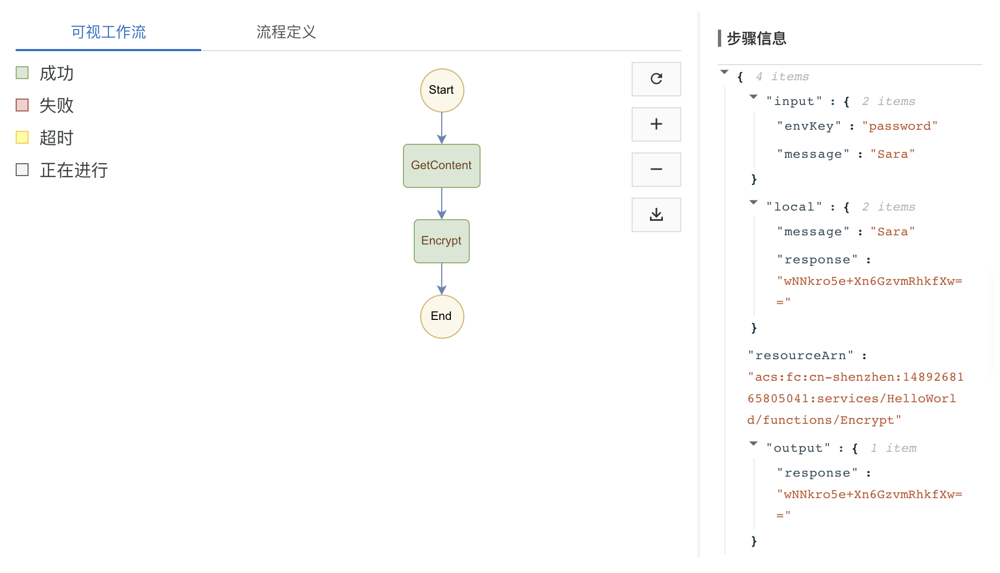

Function workflow in ALiYun
====================================

Since we have build function, there should also have an execution engine to trigger those functions and suppose it should able to control the workflow between functions.

* `Demo`_
* `More about workflow DSL`_

  * `Task Step`_
  * `Pass Step`_
  * `Parallel Step`_
  

Demo
-----------

Below is the example for workflow engine in ALiYun

Prepare for functions
^^^^^^^^^^^^^^^^^^^^^^^^^^^^^

Assume that we already had function created as below:

- HelloWorld.echo: It required an input and would be return that as content
- HelloWorld.Encrypt: It would need envKey and message as input, then encrypt that message into response result.

Create Workflow
^^^^^^^^^^^^^^^^^^^^^^^^^

.. code-block:: yml
  
  version: v1beta1
  type: flow
  steps:
    - type: task
      name: GetContent
      resourceArn: acs:fc:cn-shenzhen:1489268165805041:services/HelloWorld/functions/echo
      outputMappings:
        - target: message
          source: $local.content
    - type: task
      name: Encrypt
      resourceArn: acs:fc:cn-shenzhen:1489268165805041:services/HelloWorld/functions/Encrypt  
      inputMappings:
        - target: message
          source: $local.message
        - target: envKey
          source: "password"
  

Then, we would able to trigger this workflow with below result:

Of course, there is other ways for implement above demo. Said, above way is to create password in Encrypt steps, we could also hardcode that in Encrypt function. 

And we could also create that in a 'pass task' as below:

.. code-block:: yml
  
  version: v1beta1
  type: flow
  steps:
    - type: task
      name: GetContent
      resourceArn: acs:fc:cn-shenzhen:1489268165805041:services/HelloWorld/functions/echo
    - type: pass
      name: GeneratePassword
      outputMappings:
        - target: envKey
          source: "password"
    - type: task
      name: Encrypt
      resourceArn: acs:fc:cn-shenzhen:1489268165805041:services/HelloWorld/functions/Encrypt  
      inputMappings:
        - target: message
          source: $local.content
        - target: envKey
          source: $local.envKey

Or we could have them in parallel..(but still not able to make it work at the moment)

More about workflow DSL
----------------------------------

Task Step
^^^^^^^^^^^^^^^^^

* Below is to trigger HelloWorld.echo function, which defined in region cn-shenzhen. 
* acs:ram::1489268165805041:role/sara-execution is the user we created in RAM with right to AliyunFCInvocationAccess, then extract the id part into resourceArn 
* The origin output of echo is {"content":"sara"}, with outputMappings, we could map content to {"message":"sara"}

.. code-block:: yml
  
    - type: task
      name: GetContent
      resourceArn: acs:fc:cn-shenzhen:1489268165805041:services/HelloWorld/functions/echo
      outputMappings:
        - target: message
          source: $local.content

Pass Step
^^^^^^^^^^^^^^^^^^^^

This is mainly for transform the input and output. Similar as model mapper to remap the input/local object from previous steps into the suitable output format as prepare for next step.

.. code-block:: yml
  
    - type: pass
      name: GeneratePassword
      outputMappings:
        - target: envKey
          source: "password"

Parallel Step
^^^^^^^^^^^^^^^^^^^^^^

.. code-block:: yml
  
  steps:
    - type: parallel
      name: Prepare
      branches:
        - steps:
          - type: task
            name: GetContent
            resourceArn: acs:fc:cn-shenzhen:1489268165805041:services/HelloWorld/functions/echo
            outputMappings:
              - target: content
                source: $local.content
        - steps:
          - type: pass
            name: GeneratePassword
            outputMappings:
              - target: envKey
                source: "password"  
      outputMappings:
        - target: envKey
          source: $local.envKey
        - target: message
          source: $local.content  

  
.. index:: Serverless  

  
