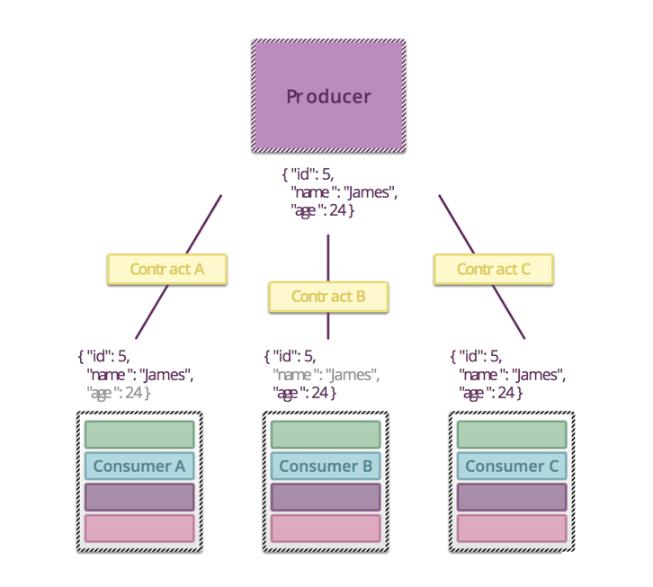
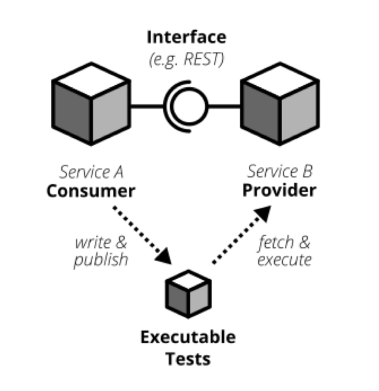

Basic Concept
====================

要说到契约测试，首先要了解3个基本名词与概念

* 生产者 Provider: 提供服务的一方（如等待界面调用的后端服务）
* 消费者 Consumer： 调用生产者获取服务的一方（如前端界面）
* 契约 Contract：每个消费者与服务者之间，消费者是如何使用接口信息调用生产者，生产者又做何回应，消费者使用哪些返回信息的约定

当有了生产者、消费者，也有了契约，进而就开始引入了如何使用这个契约规约双方，契约测试就是其中一种形式

.. index:: Testing, Contract
