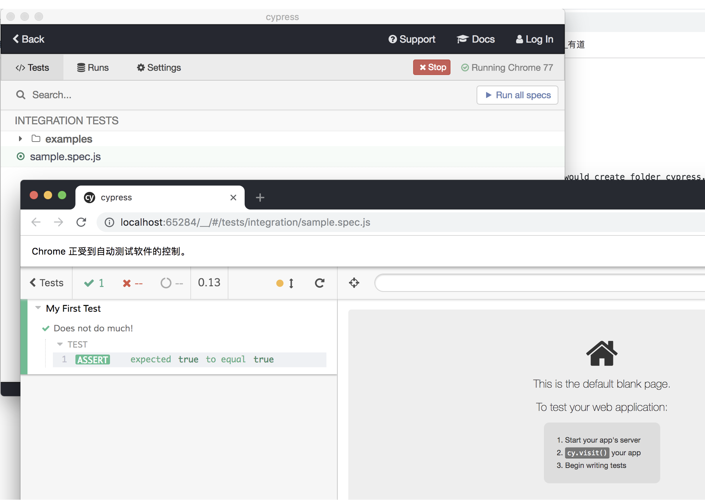

HelloWorld of Cypress
===============================

Init project
-------------------

.. code-block:: bash
  
  yarn init
  yarn add cypress

After create, it would have cypress dependency added into package.json. Also, it would create folder cypress. Inside the 'integration' folder contained lots example of test spec.

Adding test
----------------

Adding below code into said cypress/integration/demo.spec.js

.. code-block:: javascript
  
  describe('My First Test', function() {
    it('Does not do much!', function() {
      expect(true).to.equal(true)
    })
  })

Run test
---------------

Command: cypress open

It would open the GUI of cypress, manually choose above project and select that demo.spec.js. Test would be run in browser:

Other command:
^^^^^^^^^^^^^^^^^^^

* Only run 1 test case: cypress run --spec "cypress/integration/conduit.spec.js"
* Run with video upload to cypress test runner: cypress run --record --key b3b1ff07-b824-4ad8-bd29-57b57b875651
* To disable video, update in cypress.json

  .. code-block:: json
    
    {
      "projectId": "f598ft",
      "video": false
    }

.. index:: Cypress, Testing
