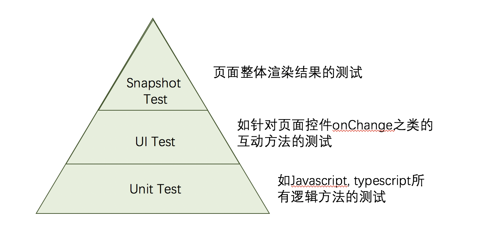

0. Testing framework
===========================

* `Why Testing with Frontend`_
* `Testing framework`_
* `Testing strategic`_

Why Testing with Frontend
------------------------------

* Confident / Remoral fear to change code
* Code Quality (Follow SRP / Better modular code / Understand what is my component doing)
* Documentation
* Developer happy wihtout 996

Testing framework
-----------------------

* **Jasmine**

  - BDD js测试框架, `官网 <https://jasmine.github.io/>`_

* **Jest**
  
  -  `Jest官网 <https://jestjs.io/docs/en/dynamodb>`_ , 大包围，包括了测试框架和断言库和mock等所需元素，只需要引入一个包就可以。
  - 内置istanbul可以直接生成coverage报告

* **Mocha** 
  
  - js测试框架，不包含断言库，所以通常搭配chai使用，`Mocha官网 <https://mochajs.org/>`_
  - 由describe/it组成，也有before/after/beforeEach/afterEach， it.skip为跳过
  - mocha --recursive -R markdown > spec.md可以把测试用例生成文档
  
* **Karma**

  - 测试运行器，包含各种驱动,允许在浏览器下运行测试.
  - Angular默认就是Jasmine+Karma (但其实另外弹出浏览器会比较慢）, 也可以搭配Mocha使用
  
* **Chai**: 断言库

.. code-block:: javascript

  import chai from 'chai';
  let expect = chai.expect;
  
  expect(4 + 5).to.be.equal(9);
  expect(false).to.not.be.ok;
  expect(foo).to.be.an.instanceof(Foo);
  expect([1,2,3]).to.include(2);
  expect([]).to.be.empty;
 
* Sinon: 用于Mock

Testing strategic
----------------------

如果分层结构解耦得比较好，逻辑和视图的测试是可以分开进行的。对于逻辑的测试，可以参考 `Jest Basic  <http://wiki.saraqian.cn/Testing/Jest/Jest1.html#>`_ , 

以下的例子主要展示视图层的测试的思路之一 （最经典的分层策略还是unit/integration/e2e),当使用Jest为测试框架，测试可以以两种方式进行: UI Test / Snapshot Test

这里强调的是UI里面的动作和渲染有需要的话也是可以分开测试。当然，这里也有潜在的悖论：

* 平常写UI测试，是可以同时验证动作和界面的元素变化，这里的界面元素变化主要针对有变动的控件，不会比较整个dom。但UI测试的编写成本比较高。
* 在Snapshot测试中，主要是渲染了整个页面dom进行比较。也有写法是先渲染比较一次，然后触发控件动作，再渲染比较一次。 Snapshot测试编写成本比较低。
* 如果按上面描述都测动作和界面的话，两种测试其实非常相近。可以按照编写成本考虑，由此Snapshot测试也未必就是塔顶了。
* 如果在控件动作的方法里面，还有其他出了界面变化以外的动作，Snapshot测试没办法测出来，还是要依靠UI测试进行。

其他测试策略：

* Unit Test -> UI Test -> Snapshot Test
* Unit Test -> Snapshot Test -> E2E Test
* Unit Test -> Integration Test -> E2E Test

.. index:: Testing, Jest, 
