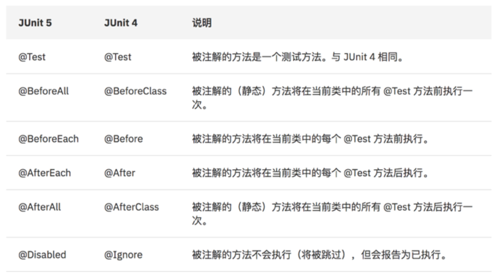

1.1 Junit4与Junit5区别
===================

*  `Exception Handling`_
*  `Annotation`_
*  `Remark`_

Exception Handling
----------------------

Junit5

.. code-block:: java

  @Test
  void shouldThrowException() throws Exception {
      Task task = buildTask();
      LocalDateTime oneHourAgo = LocalDateTime.now().minusHours(1);
      assertThrows(IllegalArgumentException.class,
            () -> task.execute(oneHourAgo));
  }
  
Junit4

.. code-block:: java

  @Test(expected = IllegalArgumentException.class)
  public void shouldThrowException() throws Exception {
      Task task = buildTask();
      LocalDateTime oneHourAgo = LocalDateTime.now().minusHours(1);  task.execute(oneHourAgo);
  }

Annotation
------------

Remark
----------

* pom.xml

.. code-block:: xml

  <dependency>
    <groupId>junit</groupId>
    <artifactId>junit</artifactId>
    <version>4.12</version>
    <scope>test</scope>
  </dependency>
  
  <dependency>
    <groupId>org.junit.jupiter</groupId>
    <artifactId>junit-jupiter</artifactId>
    <version>5.4.2</version>
    <scope>test</scope>
  </dependency>

* 务必不要在同一个测试里面尝试同时使用两种版本

.. index:: Testing

