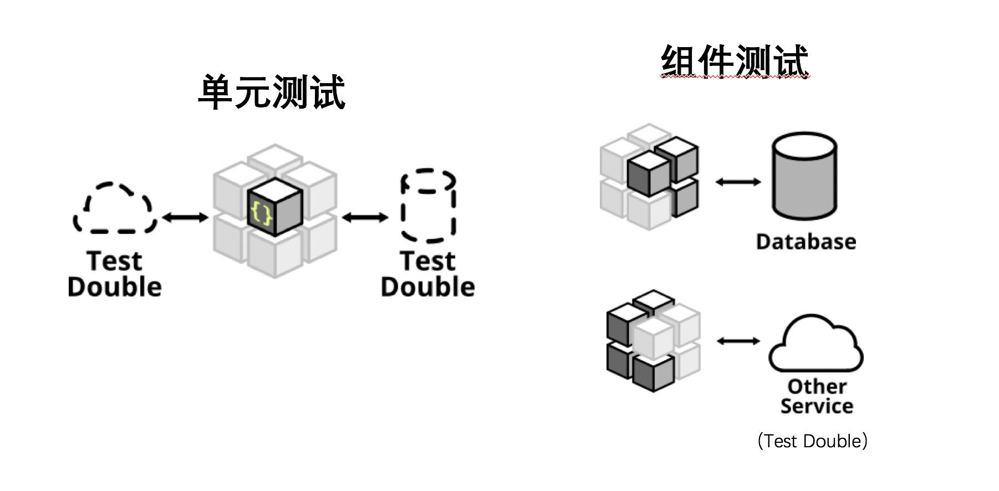

3. 组件测试
==========================

*  `什么是组件测试？`_

什么是组件测试？
------------------

* 不但只针对某一个类/方法的，可能联通了几个类/方法一起进行测试
* 可能涉及连接数据库/三方服务的逻辑
* 如在spring中，从controller都service到dao到数据库进行通测。

.. index:: Testing, Junit
