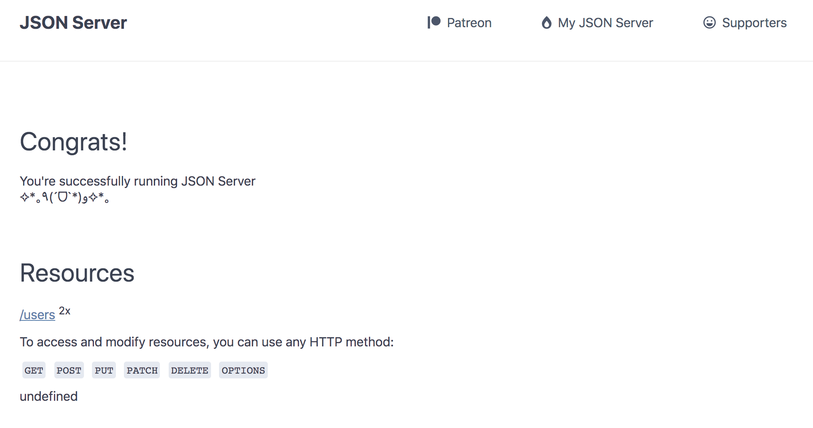

Mock Server with Json-Server
======================

Different ways to create mock server:

* `Basic Setup`_
* `Manage as Project`_

Basic Setup
----------------------

官网： https://github.com/typicode/json-server#simple-example

Only 3 steps within 10mins to create a mock sever:

* Step1. npm install -g json-server
* Step2. create db.json with the response json

.. code-block:: json
  
  {
    "users": [
        {
            "id": 1,
            "name": "Cherry",
            "age": 30
        },
        {
            "id": 2,
            "name": "Saving",
            "age": 35
        }
    ]
}

* Step3. json-server db.json

.. code-block:: bash
  
  99-1-185-165:mock-server SaraQian$ json-server db.json

  \{^_^}/ hi!

  Loading db.json
  Done

  Resources
  http://localhost:3000/users

  Home
  http://localhost:3000

  Type s + enter at any time to create a snapshot of the database

Open http://localhost:3000 will found as below:

基于以上这个json，我们已经可以获得：
^^^^^^^^^^^^^^^^^^^^^^^^^^^^^^^^^^^

* 基础查询：/users, /users/1, /users?name=Saving,...etc
* 可以排序: http://localhost:3001/users?_sort=age&_order=desc 
* 分页: http://localhost:3001/users?_page=1&_limit=1 
* 查询起始: http://localhost:3001/users?_start=1&_end=3 
* 筛选(_gte/_lte/_ne/_like)：http://localhost:3001/users?age_gte=19&age_lte=31
* 全文查询：http://localhost:3001/users?q=ing
* 父/子查询（_expand/_embed）
* 全部数据： http://localhost:3001/db

Manage as Project
----------------------------

To make it better, we could make it as a npm/yarn project to easier manage:

* 初始化项目： yarn init
* 加依赖： yarn add json-server | npm install json-server

Package.json

.. code-block:: json
  
  {
    "name": "mock-server",
    "version": "1.0.0",
    "description": "mock server with json-server",
    "scripts": {
      "start": "json-server --watch db.json --port 3001"
    },
    "author": "SaraQian",
    "license": "MIT",
    "dependencies": {
      "json-server": "^0.15.0"
    }
  }

