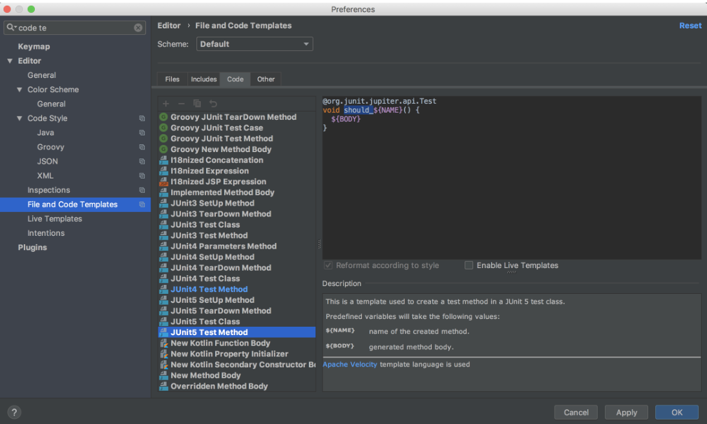
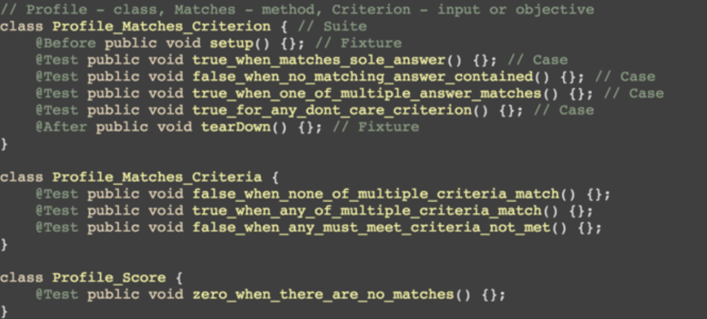

命名规范
=======

目录
^^^^

单元测试代码应该和被测代码处在同一个项目中，符合Maven标准的项目目录结构，测试代码和被测代码分开，避免测试代码被打包到制品内。::

  src #源代码目录
  ├── main/
  │   ├── java/ #被测代码
  │   └── resources/
  └── test/
      └── java/ #测试代码目录
      
包
^^

单元测试文件和被测的类文件在用一个包中（虽然分属main/test），这个可以通过IDE快捷键直接生成并对应。如：

* 被测类：com.github.abc.D.java -> 放在src/main/java/com/github/abc
* 测试类：com.github.abc.DTest.java -> 放在src/test/java/com/github/abc

对于集成测试则不需要和被测类一一对应，因为集成测试会同时测试多个类集成的流程/功能。这时候可以选择比如独立起一个包在src/test/java/integration统一放置。

文件
^^^^

单元测试文件（类）名应为被测文件（类名）加上 Test 后缀结尾，如：被测类名为SomeClass，则对应测试类为SomeClassTest

方法
^^^^

每个测试方法应该清楚的说明当前测试方法的验证的结果和成立的条件，应该是以should开头一个短句。这样的测试名字会提醒开发专注于当前的测试场景，也更易读。示例如下：

.. code-block:: java
  :linenos:
  :emphasize-lines: 2
  
  @Test
  public void should_do_something_if_some_condition_fulfills() {
      // test implementation
  }

建议使用驼峰式命名（单词全小写，单词之间下划线隔开）。

可以使用IDE修改默认模版提供更好的提示：

当所有测试命名都比较规范和能反应测试内容的时候，测试本身就成为一个解释系统功能的最好的文档:

.. index:: Testing
