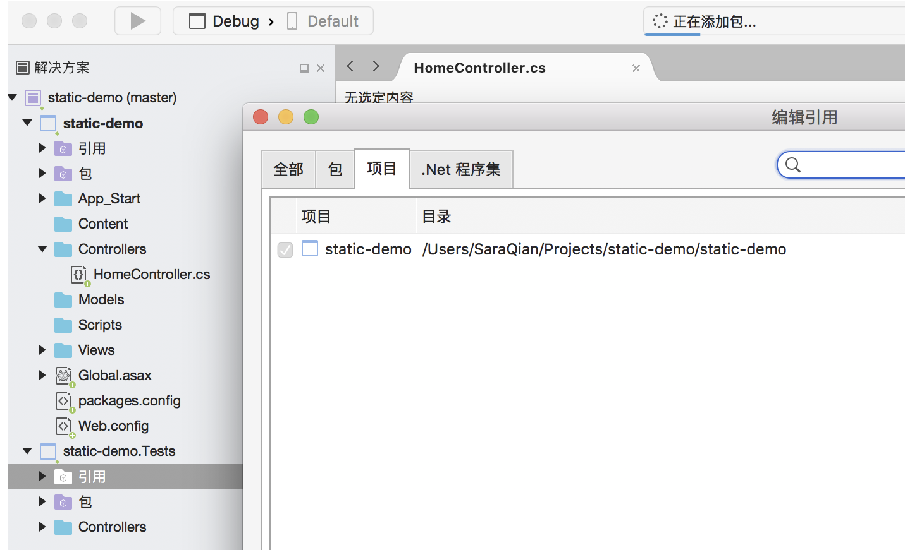

Basic Nunit Test of C#
==============================

* `Starting Note`_
* `Basic Test Example`_

Starting Note
----------------------
* 如果代码在solution/project/NumberCounterService.cs，那需要另外建solution/project.Tests/NumberCounterServiceTest.cs
* project.Tests会引用project，项目内的路径一一对应，文件名在后面添加Test
* [OneTimeSetUp]/[OneTimeTearDown]/[SetUp]/[TearDown]对应与Java中的beforeAll等用法
* [TestFixture()]/ [Test()]对应与TestSuit和测试案例@Test
* 常用assert：

  - Assert.AreEqual(expect, actual)
  - Assert.That(ex.Message, Is.EqualTo("b should not be zero when div"))
  - 触发并Assert异常： var ex = Assert.Throws<ArgumentException>(() => service.Count("DIV", 6, 0));

  

Basic Test Example
-----------------------------

solution/project/NumberCounterService.cs

.. code-block:: c#
  
  using System;
  namespace AnotherMvc.Service
  {
    public class NumberCounterService
    {
        public int Count(string type, int a, int b)
        {
            if (type.Equals("ADD"))
            {
                return a + b;
            }
            else if (type.Equals("SUB"))
            {
                return a - b;
            }
            else if (type.Equals("MUL"))
            {
                return a * b;
            }
            else if (type.Equals("DIV"))
            {
                if (b == 0) throw new System.ArgumentException("b should not be zero when div");
                return a / b;
            }
            else
            {
                throw new System.ArgumentException("Invalid input");
            }
        }
    }
  }
  
 
测试在solution/project.test/NumberCounterServiceTest.cs
 
.. code-block:: C#
  
  using NUnit.Framework;
  using System;
  using AnotherMvc.Service;

  namespace AnotherMvc.test.Service
  {
    [TestFixture()]
    public class NumberCounterServiceTest
    {
        [OneTimeSetUp]
        public void Init()
        { Console.Write("This would be only trigger once before all test"); }

        [OneTimeTearDown]
        public void Cleanup()
        { Console.Write("This would be trigger after all test"); }

        [SetUp]
        public void SetupBeforeEachTest()
        {
            Console.Write("This would be trigger before each test");
        }

        [TearDown]
        public void TearDownBeforeEachTest()
        {
            Console.Write("This would be trigger after each test");
        }

        [Test()]
        public void TestCase_should_able_to_add_number()
        {
            //given
            var service = new NumberCounterService();
            //when
            var result = service.Count("ADD", 1, 2);

            //then
            Assert.AreEqual(3, result);
        }

        [Test()]
        public void TestCase_should_able_to_sub_number()
        {
            //given
            var service = new NumberCounterService();
            //when
            var result = service.Count("SUB", 2, 1);

            //then
            Assert.AreEqual(1, result);
        }

        [Test()]
        public void TestCase_should_able_to_mul_number()
        {
            //given
            var service = new NumberCounterService();
            //when
            var result = service.Count("MUL", 3, 2);

            //then
            Assert.AreEqual(6, result);
        }

        [Test()]
        public void TestCase_should_able_to_div_number()
        {
            //given
            var service = new NumberCounterService();
            //when
            var result = service.Count("DIV", 6, 2);

            //then
            Assert.AreEqual(3, result);
        }

        [Test()]
        public void TestCase_should_throw_exception_when_div_zero()
        {
            //given
            var service = new NumberCounterService();
            //when
            var ex = Assert.Throws<ArgumentException>(() => service.Count("DIV", 6, 0));
            //then
            Assert.That(ex.Message, Is.EqualTo("b should not be zero when div"));
        }

        [Test()]
        public void TestCase_should_throw_exception_when_input_type_incorrect()
        {
            //given
            var service = new NumberCounterService();
            //when
            var ex = Assert.Throws<ArgumentException>(() => service.Count("DEV", 6, 1));
            //then
            Assert.That(ex.Message, Is.EqualTo("Invalid input"));
        }
    }
  }

.. index:: Testing, Dotnet, C#, Nunit

