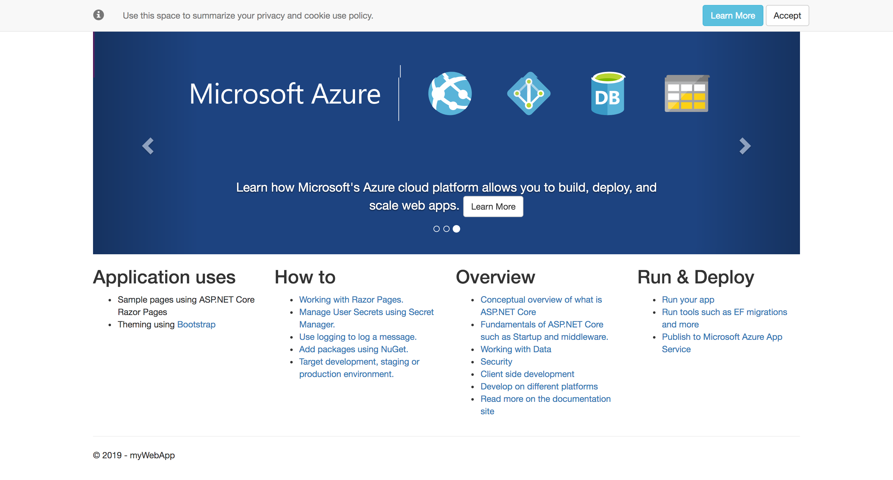
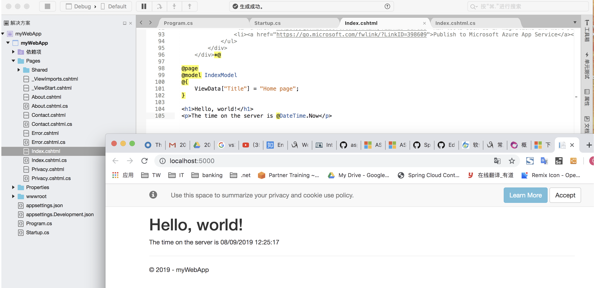
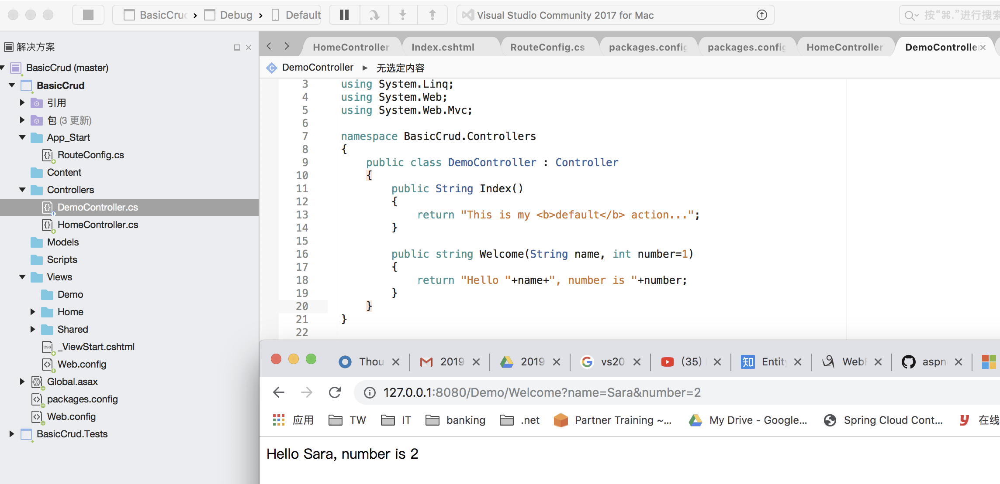

Dotnet Web HelloWorld
==========================

* `Native WebApp`_
* `MVC WebApp`_
* `Remark`_

Native WebApp
--------------------

Create Web App With CLI
^^^^^^^^^^^^^^^^^^^^^^^^^^^^^^^^

.. code-block::

  dotnet new webApp -o myWebApp --no-https
  
Run Web App With CLI
^^^^^^^^^^^^^^^^^^^^^^^^^^^^^^^^

.. code-block::

  dotnet run

Default startup link would be : http://localhost:5000/

Try edit the web page and re-run
^^^^^^^^^^^^^^^^^^^^^^^^^^^^^^^^^^^^^^^^^

MVC WebApp
--------------------

**Create porject**: If using VS IDE, create a .net MVC project(said version 5)

**Add Controller**: 'controllers' folder right click to new a controller. Said "DemoController"

.. code-block:: c#

  using System;
  using System.Collections.Generic;
  using System.Linq;
  using System.Web;
  using System.Web.Mvc;

  namespace BasicCrud.Controllers
  {
      public class DemoController : Controller
      {
          public String Index()
          {
              return "This is my <b>default</b> action...";
          }

          public string Welcome()
          {
              return "This is the Welcome action method in Demo ...";
          }
      }
  }

**Create Empty View**: And also create a new folder 'Demo" under "Views", just keep it empty as above controller would return String instead of ActionResult which required html associated.

**URL mapping**: The URL would be map according to RouteConfig.cs - url: "{controller}/{action}/{id}". So above controller would be map to url: 127.0.0.1:8080/Demo and 127.0.0.1:8080/Demo/Welcome

**Capture Param**:

Remark
------------------

* `Web Forms Guide <https://docs.microsoft.com/en-us/aspnet/mvc/overview/getting-started/getting-started-with-ef-using-mvc/implementing-basic-crud-functionality-with-the-entity-framework-in-asp-net-mvc-application>`_
* `Web MVC Guide <https://docs.microsoft.com/en-us/aspnet/mvc/>`_
